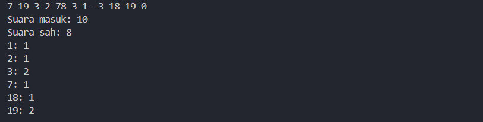
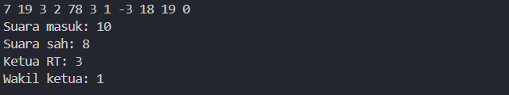
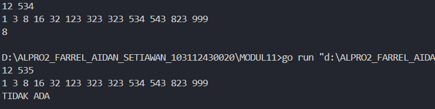

<h1 align=center>Laporan Praktikum Modul 11 PENCARIAN NILAI ACAK PADA HIMPUNAN DATA</h1>

<p align=center>Farrel Aidan Setiawan-103112430020</p>

## Dasar Teori

Berbeda dengan pencarian nilai ekstrim, yang mana nilai yang dicari selalu ditemukan, maka pada kasus pencarian ini terdapat kemungkinan bahwa data yang dicari tidak ditemukan. Selain itu pada kasus pencarian ini akan diperkenal algoritma pencarian yang memanfaatkan keterurutan data.

## Unguided

<h4>Soal 1</h4>
Pada pemilihan ketua RT yang baru saja berlangsung, terdapat 20 calon ketua yang bertanding memperebutkan suara warga. Perhitungan suara dapat segera dilakukan karena warga cukup mengisi formulir dengan nomor dari calon ketua RT yang dipilihnya. Seperti biasa, selalu ada pengisian yang tidak tepat atau dengan nomor pilihan di luar yang tersedia, sehingga data juga harus divalidasi. Tugas Anda untuk membuat program mencari siapa yang memenangkan pemilihan ketua RT. Buatlah program pilkart yang akan membaca, memvalidasi, dan menghitung suara yang diberikan dalam pemilihan ketua RT tersebut. 
Masukan hanya satu baris data saja, berisi bilangan bulat valid yang kadang tersisipi dengan data tidak valid. Data valid adalah integer dengan nilai di antara 1 s.d. 20 (inklusif). Data berakhir jika ditemukan sebuah bilangan dengan nilai 0. 
Keluaran dimulai dengan baris berisi jumlah data suara yang terbaca, diikuti baris yang berisi berapa banyak suara yang valid. Kemudian sejumlah baris yang mencetak data para calon apa saja yang mendapatkan suara.

```go
package main
import "fmt"

func main() {
    const MAX = 20
    var suara [MAX + 1]int
    var jumlahMasukan, jumlahSah int

    for {
        var x int
        fmt.Scan(&x)
        if x == 0 {
            break
        }
        jumlahMasukan++
        if x >= 1 && x <= MAX {
            suara[x]++
            jumlahSah++
        }
    }

    fmt.Println("Suara masuk:", jumlahMasukan)
    fmt.Println("Suara sah:", jumlahSah)
    for i := 1; i <= MAX; i++ {
        if suara[i] > 0 {
            fmt.Printf("%d: %d\n", i, suara[i])
        }
    }
}
```

>**Output**
>
>

Program ini bertujuan untuk menghitung jumlah data yang masuk dan jumlah data yang termasuk valid dari sekumpulan bilangan bulat. Program menggunakan array bertipe data integer dengan  indeks 1 sampai 20 merepresentasikan nilai data yang diterima. Ada juga variable jumlahMasukan dengan tipe data integer untuk menghitung seluruh data yang diterima, dan jumlahSah dengan tipe data integer untuk menghitung data yang termasuk dalam indeks.

Data dibaca secara berulang dengan menggunakan perulangan tak hingga yang dihentikan ketika ditemukan nilai nol. Setiap data yang masuk akan menambah nilai jumlahMasukan. Jika data tersebut berada dalam rentang satu sampai dua puluh, maka nilai pada indeks array akan ditambah satu dan jumlahSah juga bertambah.

Setelah semua data selesai diproses, program mencetak jumlah data yang diterima secara keseluruhan, jumlah data yang valid, serta daftar nilai dari satu sampai dua puluh.

<h4>Soal 2</h4>
Berdasarkan program sebelumnya, buat program pilkart yang mencari siapa pemenang pemilihan ketua RT. Sekaligus juga ditentukan bahwa wakil ketua RT adalah calon yang mendapatkan suara terbanyak kedua. Jika beberapa calon mendapatkan suara terbanyak yang sama, ketua terpilih adalah dengan nomor peserta yang paling kecil dan wakilnya dengan nomor peserta terkecil berikutnya. 
Masukan hanya satu baris data saja, berisi bilangan bulat valid yang kadang tersisipi dengan data tidak valid. Data valid adalah bilangan bulat dengan nilai di antara 1 s.d. 20 (inklusif). Data berakhir jika ditemukan sebuah bilangan dengan nilai 0. 
Keluaran dimulai dengan baris berisi jumlah data suara yang terbaca, diikuti baris yang berisi berapa banyak suara yang valid. Kemudian tercetak calon nomor berapa saja yang menjadi pasangan ketua RT dan wakil ketua RT yang baru.

```go
package main
import "fmt"

func main() {
    const MAX = 20
    var suara [MAX + 1]int
    var jumlahMasukan, jumlahSah int
    var x int

    for {
        fmt.Scan(&x)

        if x == 0 {
            break
        }
        jumlahMasukan++
        if x >= 1 && x <= MAX {
            suara[x]++
            jumlahSah++
        }
    }

    fmt.Println("Suara masuk:", jumlahMasukan)
    fmt.Println("Suara sah:", jumlahSah)

    ketua, wakil := 0, 0
    max1, max2 := 0, 0

    for i := 1; i <= MAX; i++ {
        if suara[i] > max1 {
            max2 = max1
            wakil = ketua
            max1 = suara[i]
            ketua = i
        } else if suara[i] == max1 && i < ketua {
            max2 = max1
            wakil = ketua
            ketua = i
        } else if suara[i] > max2 && suara[i] < max1 {
            max2 = suara[i]
            wakil = i
        } else if suara[i] == max2 && i < wakil {
            wakil = i
        }
    }

    fmt.Println("Ketua RT:", ketua)
    fmt.Println("Wakil ketua:", wakil)

}
```

>**Output**
>
>

Program ini bertujuan untuk menghitung jumlah suara yang masuk, menentukan suara yang sah, serta mencari ketua dan wakil ketua RT berdasarkan suara terbanyak. Program menggunakan array bertipe integer dengan indeks 1 sampai 20 untuk menyimpan jumlah suara masing-masing calon.
Variabel jumlahMasukan bertipe data integer digunakan untuk menghitung seluruh data yang masuk, sedangkan jumlahSah bertipe data integer untuk menghitung.

Data dibaca dengan perulangan tak hingga yang akan berhenti jika ditemukan nilai 0. Setiap data yang masuk akan menambah jumlahMasukan. Jika data tersebut valid, maka nilai pada indeks array suara akan ditambah dan jumlahSah bertambah satu.

Setelah semua data dibaca, program mencetak jumlah suara masuk dan jumlah suara sah. Kemudian dilakukan pencarian calon dengan suara terbanyak untuk ditetapkan sebagai ketua, dan calon dengan suara terbanyak kedua sebagai wakil. Jika ada suara yang sama banyak, calon dengan nomor lebih kecil dipilih terlebih dahulu, lalu program mencetak hasil ketua dan wakil ketua RT.

<h4>Soal 3</h4>
Diberikan n data integer positif dalam keadaan terurut membesar dan sebuah integer lain k, apakah bilangan k tersebut ada dalam daftar bilangan yang diberikan? Jika ya, berikan indeksnya, jika tidak sebutkan "TIDAK ADA". 
Masukan terdiri dari dua baris. Baris pertama berisi dua buah integer positif, yaitu n dan k. n menyatakan banyaknya data, dimana 1 < n <= 1000000. k adalah bilangan yang ingin dicari. Baris kedua berisi n buah data integer positif yang sudah terurut membesar. 
Keluaran terdiri dari satu baris saja, yaitu sebuah bilangan yang menyatakan posisi data yang dicari (k) dalam kumpulan data yang diberikan. Posisi data dihitung dimulai dari angka 0. Atau memberikan keluaran "TIDAK ADA" jika data k tersebut tidak ditemukan dalam kumpulan. Program yang dibangun harus menggunakan subprogram dengan mengikuti kerangka yang sudah diberikan berikut ini.

```go
package main
import "fmt"

const NMAX = 1000000
var data [NMAX]int

func main() {
    var n, k int
    fmt.Scan(&n, &k)

    isiArray(n)
    pos := posisi(n, k)

    if pos == -1 {
        fmt.Println("TIDAK ADA")
    } else {
        fmt.Println(pos)
    }
}

func isiArray(n int) {
    for i := 0; i < n; i++ {
        fmt.Scan(&data[i])
    }
}

func posisi(n, k int) int {
    kiri := 0
    kanan := n - 1

    for kiri <= kanan {
        tengah := (kiri + kanan) / 2
        if data[tengah] == k {
            return tengah
        } else if data[tengah] < k {
            kiri = tengah + 1
        } else {
            kanan = tengah - 1
        }
    }

    return -1
}
```

>**Output**
>
>

Program ini bertujuan untuk mencari apakah sebuah bilangan tertentu terdapat dalam sekumpulan data yang sudah terurut membesar. Jika bilangan tersebut ditemukan, program akan mencetak posisi indeksnya. Jika tidak ditemukan, maka akan mencetak "TIDAK ADA".

Program menggunakan array bertipe integer dengan ukuran maksimal 1000000. Variabel n bertipe data integer digunakan untuk menyimpan jumlah data, dan variabel k bertipe data integer digunakan untuk menyimpan bilangan yang ingin dicari.

func isiArray(n int) membaca n dan menyimpannya ke dalam array data. func posisi(n, k int) int melakukan pencarian dengan metode binary search. Pencarian dilakukan dengan membandingkan nilai tengah dari rentang pencarian dengan nilai yang dicari. Jika nilai tengah sama dengan k, maka indeks tengah dikembalikan. Jika nilai tengah lebih kecil dari k, maka pencarian dilanjutkan ke bagian kanan. Jika lebih besar, pencarian dilanjutkan ke bagian kiri. Proses ini berulang sampai data ditemukan atau tidak ditemukan. Jika data ditemukan, program mencetak posisi indeksnya. Jika tidak ditemukan, maka akan mencetak "TIDAK ADA".
