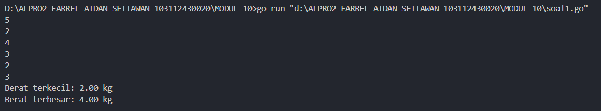
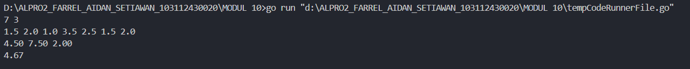
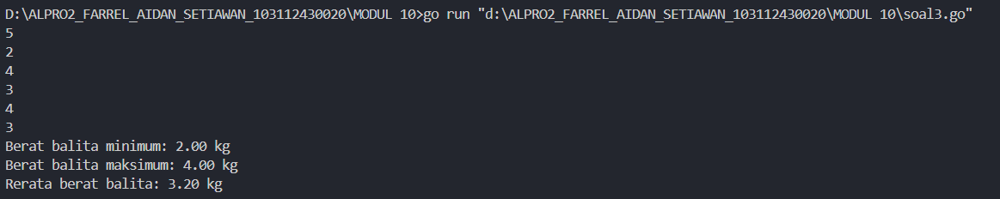

___
<h1 align=center>Laporan Praktikum Modul 10 PENCARIAN NILAI EKSTRIM PADA HIMPUNAN DATA</h1>
___
<p align=center>Farrel Aidan Setiawan-103112430020</p>
## Dasar Teori
___
Pencarian adalah suatu proses yang lazim dilakukan di dalam kehidupan sehari-hari. Contoh penggunaannya dalam kehidupan nyata sangat beragam, misalnya pencarian file di dalam directory komputer, pencarian suatu teks di dalam sebuah dokumen, pencarian buku pada rak buku, dan contoh lainnya. Pertama pada modul ini akan dipelajari salah satu algoritma pencarian nilai terkecil atau terbesar pada sekumpulan data, atau biasa disebut pencarian nilai ekstrim.

## Unguided
___
<h4>Soal 1</h4>
Sebuah program digunakan untuk mendata berat anak kelinci yang akan dijual ke pasar. Program ini menggunakan array dengan kapasitas 1000 untuk menampung data berat anak kelinci yang akan dijual. 

Masukan terdiri dari sekumpulan bilangan, yang mana bilangan pertama adalah bilangan bulat N yang menyatakan banyaknya anak kelinci yang akan ditimbang beratnya. Selanjutnya N bilangan riil berikutnya adalah berat dari anak kelinci yang akan dijual. 
Keluaran terdiri dari dua buah bilangan riil yang menyatakan berat kelinci terkecil dan terbesar

```go
package main
import "fmt"

func main() {
    const kapasitas = 1000
    var berat [kapasitas]float64
    var n int

    fmt.Scan(&n)

    if n < 1 || n > kapasitas {
        fmt.Println("Jumlah anak kelinci tidak valid.")
        return
    }

    for i := 0; i < n; i++ {
        fmt.Scan(&berat[i])
    }


    minBerat := berat[0]
    maxBerat := berat[0]


    for i := 1; i < n; i++ {
        if berat[i] < minBerat {
            minBerat = berat[i]
        }
        if berat[i] > maxBerat {
            maxBerat = berat[i]
        }
    }

    fmt.Printf("Berat terkecil: %.2f kg\n", minBerat)
    fmt.Printf("Berat terbesar: %.2f kg\n", maxBerat)
}
```

>**Output**
>

Program ini bertujuan untuk mencari berat terkecil dan terbesar dari anak kelinci. Program menggunakan array berat bertipe float64 untuk menyimpan data berat masing-masing anak kelinci, dengan kapasitas maksimum 1000 data. Nilai n merupakan masukan jumlah anak kelinci yang akan dimasukkan. Jika nilai n kurang dari 1 atau melebihi kapasitas, program akan mencetak pesan bahwa jumlah anak kelinci tidak valid.

Setelah input jumlah anak kelinci valid, program akan membaca nilai berat sebanyak masukan n dan menyimpannya ke dalam array. Kemudian, dua variabel minBerat dan maxBerat bertipe data int ditetapkan dengan nilai berat anak kelinci. Program menggunakan perulangan untuk memeriksa seluruh masukan dalam array, dan memperbarui nilai minBerat jika ditemukan berat yang lebih kecil, serta maxBerat jika ditemukan berat yang lebih besar.

Lalu nilai berat terkecil dan terbesar dicetak ke layar dengan format dua angka di belakang koma dan satuan kilogram.

<h4>Soal 2</h4>
Sebuah program digunakan untuk menentukan tarif ikan yang akan dijual ke pasar. Program ini menggunakan array dengan kapasitas 1000 untuk menampung data berat ikan yang akan dijual. Masukan terdiri dari dua baris, yang mana baris pertama terdiri dari dua bilangan bulat x dan y. Bilangan x menyatakan banyaknya ikan yang akan dijual, sedangkan y adalah banyaknya ikan yang akan dimasukan ke dalam wadah. Baris kedua terdiri dari sejumlah x bilangan riil yang menyatakan banyaknya ikan yang akan dijual. Keluaran terdiri dari dua baris. Baris pertama adalah kumpulan bilangan riil yang menyatakan total berat ikan di setiap wadah (jumlah wadah tergantung pada nilai x dan y, urutan ikan yang dimasukan ke dalam wadah sesuai urutan pada masukan baris ke-2). Baris kedua adalah sebuah bilangan riil yang menyatakan berat rata-rata ikan di setiap wadah.

```go
package main
import "fmt"

func main() {
    const kapasitas = 1000
    var beratIkan [kapasitas]float64
    var x, y int

    fmt.Scan(&x, &y)

  
    if x < 1 || x > kapasitas || y < 1 {
        return
    }

    for i := 0; i < x; i++ {
        fmt.Scan(&beratIkan[i])
    }


    var totalBeratPerWadah [kapasitas]float64
    jumlahWadah := (x + y - 1) / y

    for i := 0; i < jumlahWadah; i++ {
        total := 0.0
        for j := i * y; j < (i+1)*y && j < x; j++ {
            total += beratIkan[j]
        }
        totalBeratPerWadah[i] = total
    }

    for i := 0; i < jumlahWadah; i++ {
        fmt.Printf("%.2f ", totalBeratPerWadah[i])
    }
    
    fmt.Println()

    rataRata := 0.0

    for i := 0; i < jumlahWadah; i++ {
        rataRata += totalBeratPerWadah[i]
    }

    rataRata /= float64(jumlahWadah)
    fmt.Printf("%.2f\n", rataRata)

}
```

>**Output**
>

Program ini bertujuan untuk menghitung total berat ikan dalam setiap wadah serta menghitung rata-rata total berat per wadah. Program menggunakan array beratIkan bertipe float64 untuk menyimpan berat dari setiap ikan, dengan kapasitas maksimum 1000. Nilai x dan y dibaca dari input, yang masing-masing merepresentasikan jumlah ikan dan kapasitas maksimum ikan per wadah. Jika jumlah ikan kurang dari 1 atau melebihi kapasitas, atau jika kapasitas wadah kurang dari 1, maka program akan berhenti.

Setelah inputan benar, program membaca berat setiap ikan sebanyak masukan x dan menyimpannya ke dalam array. Program kemudian menghitung jumlah wadah yang dibutuhkan dengan rumus pembulatan ke atas dari x dibagi y. Untuk setiap wadah, program menjumlahkan berat ikan yang dimasukkan ke dalamnya dan menyimpan hasilnya ke dalam array totalBeratPerWadah. Setelah semua perhitungan selesai, program mencetak total berat ikan di setiap wadah.

Lalu program akan menghitung rata-rata total berat per wadah dengan menjumlahkan seluruh elemen dalam array totalBeratPerWadah lalu membaginya dengan jumlah wadah dan menampilkan hasilnya.

<h4>Soal 3</h4>
Pos Pelayanan Terpadu (posyandu) sebagai tempat pelayanan kesehatan perlu mencatat data berat balita (dalam kg). Petugas akan memasukkan data tersebut ke dalam array. Dari data yang diperoleh akan dicari berat balita terkecil, terbesar, dan reratanya.

```go
package main
import "fmt"

  
type arrBalita [100]float64

func hitungMinMax(arrBerat arrBalita, n int, bMin, bMax *float64) {
    *bMin = arrBerat[0]
    *bMax = arrBerat[0]
    for i := 1; i < n; i++ {
        if arrBerat[i] < *bMin {
            *bMin = arrBerat[i]
        }
        if arrBerat[i] > *bMax {
            *bMax = arrBerat[i]
        }
    }
}


func rerata(arrBerat arrBalita, n int) float64 {
    total := 0.0
    for i := 0; i < n; i++ {
        total += arrBerat[i]
    }
    return total / float64(n)
}

func main() {
    var data arrBalita
    var n int

    fmt.Scan(&n)

    for i := 0; i < n; i++ {
        fmt.Scan(&data[i])
    }

    var min, max float64
    hitungMinMax(data, n, &min, &max)
    rer := rerata(data, n)

    fmt.Printf("Berat balita minimum: %.2f kg\n", min)
    fmt.Printf("Berat balita maksimum: %.2f kg\n", max)
    fmt.Printf("Rerata berat balita: %.2f kg\n", rer)
}
```

>**Output**
>

Program ini bertujuan untuk menghitung berat minimum, maksimum, dan rata-rata dari sejumlah balita. Program menggunakan type arrBalita yang didefinisikan sebagai array dengan panjang 100 dan bertipe float64. Data berat balita disimpan dalam array tersebut, sementara variabel n digunakan untuk menyimpan jumlah balita yang akan diinput. Jika n sudah dimasukkan, program membaca berat masing-masing balita sebanyak n kali dari input.

func hitungMinMax(arrBerat arrBalita, n int, bMin, bMax * float64) menerima array berat, jumlah data, dan dua pointer ke float64 untuk menyimpan hasil minimum dan maksimum. Fungsi ini menginisialisasi nilai awal bMin dan bMax dari elemen pertama array, kemudian membandingkan setiap elemen berikutnya untuk mencari nilai yang lebih kecil dan lebih besar. Lalu func rerata(arrBerat arrBalita, n int) float64 menghitung jumlah seluruh elemen dalam array dan membaginya dengan jumlah data untuk mendapatkan nilai rata-rata.

Setelah semua perhitungan dilakukan, fungsi main mencetak hasil berat balita minimum, maksimum, dan rata-ratanya ke layar dengan dua angka di belakang koma serta satuan kilogram. 