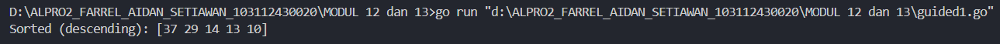
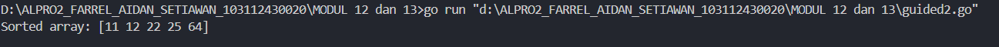
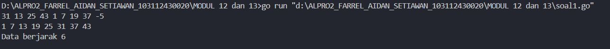
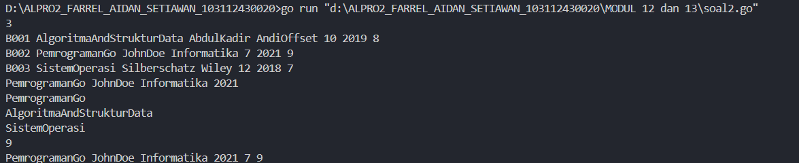

___
<h1 align=center>Laporan Praktikum Modul 11 PENCARIAN NILAI ACAK PADA HIMPUNAN DATA</h1>
___
<p align=center>Farrel Aidan Setiawan-103112430020</p>
## Dasar Teori
___
Berbeda dengan pencarian nilai ekstrim, yang mana nilai yang dicari selalu ditemukan, maka pada kasus pencarian ini terdapat kemungkinan bahwa data yang dicari tidak ditemukan. Selain itu pada kasus pencarian ini akan diperkenal algoritma pencarian yang memanfaatkan keterurutan data.

## Guided

<h4>Soal 1</h4>
Diberikan `n` bilangan bulat positif. Buat program untuk mengurutkan angka ganjil secara **membesar (ascending)** dan angka genap secara **mengecil (descending)**, lalu gabungkan hasilnya dengan ganjil duluan.

Gunakan **selection sort** dalam proses pengurutan.

**Masukan:**

- Baris pertama berisi bilangan bulat `n` (1 ≤ n ≤ 100).
- Baris kedua berisi `n` bilangan bulat positif.

**Keluaran:**

- Satu baris berisi angka ganjil terurut membesar diikuti angka genap terurut mengecil.

**Contoh Masukan:**

```

10

12 7 3 2 9 6 8 1 11 4

```

**Contoh Keluaran:**

```

1 3 7 9 11 12 8 6 4 2

```

```go
package main
import "fmt"
func insertionSort(arr []int, panjang int) {
	var temp, i, j int
	for i = 1; i < panjang; i++ {
		temp = arr[i]
		j = i
		for j > 0 && temp > arr[j-1] {
			arr[j] = arr[j-1]
			j--
		}
		arr[j] = temp
	}
}
// Example usage
func main() {
	numbers := []int{29, 10, 14, 37, 13}
	insertionSort(numbers, len(numbers))
	fmt.Println("Sorted (descending):", numbers)
}
```

>**Output**
>

Program ini dibuat untuk mengurutkan angka secara menurun dengan algoritma insertion sort. func insertionSort(arr []int, panjang int) menerima slice integer dan panjangnya sebagai parameter.
Fungsi ini bekerja dengan membandingkan setiap elemen dengan elemen sebelumnya. Algoritma menggunakan tiga variabel temp, i, j bertipe data int untuk pengurutan, mulai dari elemen kedua hingga terakhir.

Program akan mengambil elemen saat ini, menyimpannya di variabel temp, lalu membandingkannya dengan elemen sebelumnya. Jika elemen saat ini lebih besar, elemen sebelumnya digeser. Proses ini berlanjut sampai menemukan posisi tepat untuk elemen tersebut.

Pada fungsi main(), slice numbers dibuat dengan nilai {29, 10, 14, 37, 13}. Setelah fungsi insertionSort dipanggil, program mencetak hasil pengurutan menurun ke layar.

<h4>Soal 2</h4>
Sebuah kelas memiliki sejumlah siswa yang telah mengikuti ujian. Tugas Anda adalah membuat program yang membaca nilai-nilai ujian siswa dengan struct berisikan `nim` dan `nilai`, lalu mengurutkannya dari yang tertinggi ke yang terendah menggunakan **insertion sort**.

**Masukan:**

- Baris pertama adalah sebuah bilangan bulat `n` (1 ≤ n ≤ 100), menyatakan jumlah siswa.
- Baris berikutnya berisi `n` bilangan bulat yang masing-masing adalah nilai ujian (0–100).

**Keluaran:**

- Satu baris berisi nilai-nilai yang sudah terurut dari terbesar ke terkecil.

**Contoh Masukan:**

```

6

75 60 90 80 100 65

```

**Contoh Keluaran:**

```

100 90 80 75 65 60

```

```go
package main
import "fmt"
func selectionSort(arr []int, panjang int) {
	var temp, i, j, idxMin int
	for i = 0; i < panjang-1; i++ {
		idxMin = i
		for j = i + 1; j < panjang; j++ {
			if arr[j] < arr[idxMin] {
				idxMin = j
			}
		}
		temp = arr[idxMin]
		arr[idxMin] = arr[i]
		arr[i] = temp
	}
}
// Example usage
func main() {
	numbers := []int{64, 25, 12, 22, 11}
	selectionSort(numbers, len(numbers))
	fmt.Println("Sorted array:", numbers)
}
```

>**Output**
>

Program ini dibuat untuk mengurutkan angka secara menaik menggunakan algoritma selection sort. func selectionSort(arr []int, panjang int) akan menerima slice integer dan panjang sebagai parameter. Fungsi ini akan mencari elemen terkecil dari bagian array yang belum diurutkan, kemudian ditukar dengan elemen pertama dari bagian yang belum diurutkan. Terdapat empat variabel yaitu temp, i, j, idxMin bertipe data int.

program akan melakukan perulangan luar dari elemen pertama hingga satu elemen sebelum terakhir. Untuk setiap perulangan luar, program mencari elemen terkecil dengan melakukan perulangan dalam dari posisi i+1 hingga elemen terakhir. Setelah menemukan elemen terkecil, dilakukan pertukaran antara elemen tersebut dengan elemen pada posisi i.

Pada fungsi main(), slice numbers dibuat dengan nilai {64, 25, 12, 22, 11}. Setelah func selectionSort(arr []int, panjang int) dipanggil, program mencetak hasil pengurutan menaik ke layar dengan pesan "Sorted array:" diikuti dengan angka-angka yang sudah terurut dari kecil ke besar.

## Unguided

<h4>Soal 1</h4>
```go
package main
import "fmt"

func insertionSort(T []int, n int) {
    var temp, i, j int
    i = 1
    for i < n {
        j = i
        temp = T[j]
        for j > 0 && temp < T[j-1] {
            T[j] = T[j-1]
            j = j - 1
        }
        T[j] = temp
        i = i + 1
    }
}

func cekJarakTetap(T []int, n int) (bool, int) {
    var status bool
    var jarak int
    if n <= 1 {
        status = true
        jarak = 0
        return status, jarak
    }
    status = true
    jarak = T[1] - T[0]
    i := 2
    for i < n {
        if T[i] - T[i-1] != jarak {
            status = false
            break
        }
        i = i + 1
    }
    return status, jarak
}

func main() {
    var data []int
    var bil int

    for {
        fmt.Scan(&bil)
        if bil < 0 {
            break
        }
        data = append(data, bil)
    }
    
    n := len(data)
    insertionSort(data, n)
    i := 0
    for i < n {
        fmt.Print(data[i])
        if i < n-1 {
            fmt.Print(" ")
        }
        i = i + 1
    }
    fmt.Println()
    
    status, jarak := cekJarakTetap(data, n)
    if status {
        fmt.Println("Data berjarak", jarak)
    } else {
        fmt.Println("Data berjarak tidak tetap")
    }
}
```

>**Output**
>

Program ini dibuat untuk mengurutkan bilangan bulat dengan algoritma insertion sort dan memeriksa apakah data terurut memiliki jarak yang sama antar elemen. 

func insertionSort(T []int, n int) yang memiliki variable temp, i, j bertipe data int akan mengambil satu per satu elemen dan menyimpannya di variabel temp, lalu dibandingkan dengan elemen sebelumnya. Jika lebih kecil, maka elemen sebelumnya digeser, hingga menemukan posisi yang benar. 

func cekJarakTetap(T []int, n int) (bool, int) dengan variable status bertipe data bool dan jarak bertipe data int akan memeriksa konsistensi jarak antar elemen terurut. Fungsi ini menghitung jarak antara dua elemen pertama, lalu membandingkannya dengan jarak elemen-elemen berikutnya. Fungsi mengembalikan status dan nilai jarak. Dalamfunc main() program membaca bilangan hingga menerima input negatif, mengurutkannya, mencetak hasil, dan menampilkan hasilnya

<h4>Soal 2</h4>
Sebuah program perpustakaan digunakan untuk mengelola data buku di dalam suatu perpustakaan. Misalnya terdefinisi struct dan array seperti berikut ini: 

Masukan terdiri dari beberapa baris. Baris pertama adalah bilangan bulat N yang menyatakan banyaknya data buku yang ada di dalam perpustakaan. N baris berikutnya, masing-masingnya adalah data buku sesuai dengan atribut atau field pada struct. Baris terakhir adalah bilangan bulat yang menyatakan rating buku yang akan dicari.

Keluaran terdiri dari beberapa baris. Baris pertama adalah data buku terfavorit, baris kedua adalah lima judul buku dengan rating tertinggi, selanjutnya baris terakhir adalah data buku yang dicari sesuai rating yang diberikan pada masukan baris terakhir.

```go
package main
import "fmt"

const nMax int = 7919
type Buku struct {
    id, judul, penulis, penerbit string
    eksemplar, tahun, rating     int
}
type DaftarBuku [nMax]Buku
func DaftarkanBuku(pustaka *DaftarBuku, n int) 

    var i int
    i = 0
    for i < n {
        fmt.Scan(&pustaka[i].id)
        fmt.Scan(&pustaka[i].judul)
        fmt.Scan(&pustaka[i].penulis)
        fmt.Scan(&pustaka[i].penerbit)
        fmt.Scan(&pustaka[i].eksemplar)
        fmt.Scan(&pustaka[i].tahun)
        fmt.Scan(&pustaka[i].rating)
        i = i + 1
    }
}

func CetakTerfavorit(pustaka DaftarBuku, n int) {

    var idxMax, i int
    idxMax = 0
    i = 1
    for i < n {
        if pustaka[i].rating > pustaka[idxMax].rating {
            idxMax = i
        }
        i = i + 1
    }
    fmt.Println(pustaka[idxMax].judul, pustaka[idxMax].penulis,
        pustaka[idxMax].penerbit, pustaka[idxMax].tahun)
}

func UrutBuku(pustaka *DaftarBuku, n int) {

    var temp Buku
    var i, j int

    i = 1
    for i < n {
        j = i
        temp = pustaka[j]
        for j > 0 && temp.rating > pustaka[j-1].rating {
            pustaka[j] = pustaka[j-1]
            j = j - 1
        }
        pustaka[j] = temp
        i = i + 1
    }
}

func CetakTerbaru(pustaka DaftarBuku, n int) {

    var i, batas int
    if n < 5 {
        batas = n
    } else {
        batas = 5
    }

    i = 0
    for i < batas {
        fmt.Println(pustaka[i].judul)
        i = i + 1
    }
}

func CariBuku(pustaka DaftarBuku, n int, r int) {
    var kiri, kanan, tengah int
    var ketemu bool

    kiri = 0
    kanan = n - 1
    ketemu = false
    for kiri <= kanan && !ketemu {
        tengah = (kiri + kanan) / 2
        if pustaka[tengah].rating == r {
            ketemu = true
        } else if pustaka[tengah].rating > r {
            kiri = tengah + 1
        } else {
            kanan = tengah - 1
        }
    }

    if ketemu {
        fmt.Println(pustaka[tengah].judul, pustaka[tengah].penulis,
            pustaka[tengah].penerbit, pustaka[tengah].tahun,
            pustaka[tengah].eksemplar, pustaka[tengah].rating)
    } else {
        fmt.Println("Tidak ada buku dengan rating seperti itu")
    }
}


func main() {
    var pustaka DaftarBuku
    var n, ratingCari int
    fmt.Scan(&n)
    DaftarkanBuku(&pustaka, n)
    CetakTerfavorit(pustaka, n)
    UrutBuku(&pustaka, n)
    Cetak5Terbaru(pustaka, n)
    fmt.Scan(&ratingCari)
    CariBuku(pustaka, n, ratingCari)
}
```

>**Output**
>

Program ini dibuat untuk mendata, mengurutkan, dan mencari buku berdasarkan rating tertinggi menggunakan array dan tipe data bentukan dalam bahasa Go. type Buku struct menyimpan informasi penting seperti ID, judul, penulis, penerbit, jumlah eksemplar, tahun terbit, dan rating. Data buku disimpan dalam array DaftarBuku berkapasitas maksimum 7919 elemen. func DaftarkanBuku(pustaka * DaftarBuku, n int)  digunakan untuk membaca input data buku dan menyimpannya ke dalam array. Setelah semua data masuk, func CetakTerfavorit(pustaka DaftarBuku, n int) mencari buku dengan rating tertinggi dan mencetak informasi utama dari buku tersebut.

Selanjutnya, func UrutBuku(pustaka * DaftarBuku, n int) mengurutkan buku berdasarkan rating secara menurun menggunakan algoritma insertion sort. Setelah proses pengurutan, func CetakTerbaru(pustaka DaftarBuku, n int) mencetak maksimal lima buku teratas sesuai urutan tersebut. Untuk mencari buku berdasarkan rating tertentu, digunakan func CariBuku(pustaka DaftarBuku, n int, r int) dengan metode binary search. Jika buku ditemukan, program akan mencetak semua informasinya, jika tidak, akan muncul pesan bahwa tidak ada buku dengan rating tersebut. Semua fungsi tersebut dijalankan berurutan di dalam fungsi main, dimulai dari input data, menampilkan buku terbaik, pengurutan, pencetakan lima teratas, dan pencarian.