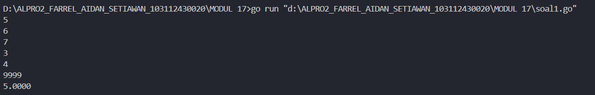
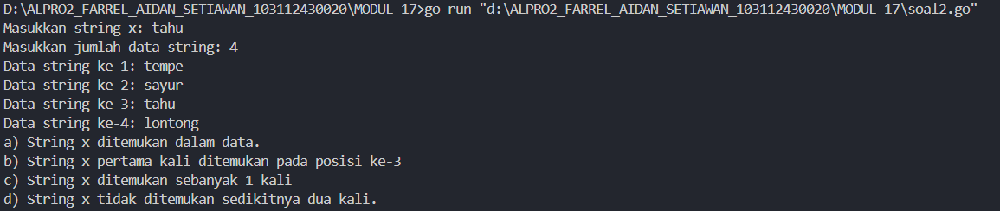
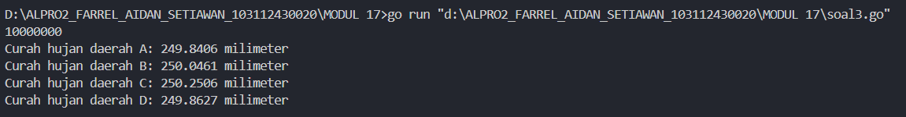
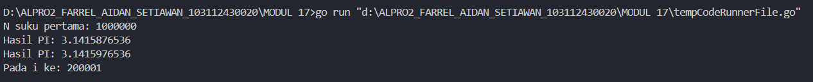
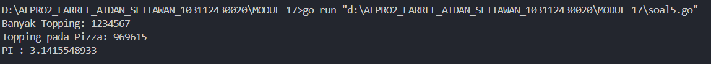

<h1 align=center>Laporan Praktikum MODUL 17. SKEMA PEMROSESAN SEKUENSIAL</h1>

<p align=center>Farrel Aidan Setiawan-103112430020</p>

## Dasar Teori

Dengan dipersenjatai bentuk perulangan dan bentuk percabangan, banyak problem komputasi yang dapat diselesaikan. Berikut ini beberapa skema (pola) yang umum ditemukan untuk pemrosesan data (secara sekuensial)

## Unguided

<h4>Soal 1</h4>
Diberikan sejumlah bilangan real yang diakhiri dengan marker 9999, cari rerata dari bilanganbilangan tersebut.

```go
package main
import "fmt"

func main() {

    var marker float64
    var jumlah float64 = 0
    var banyak int = 0

    fmt.Scanln(&marker)
    if marker == 9999 {
        fmt.Println("Tidak ada data untuk dihitung.")
    } else {
        jumlah += marker
        banyak++


        fmt.Scanln(&marker)
        for marker != 9999 {
            jumlah += marker
            banyak++
            fmt.Scanln(&marker)
        }
        rata := jumlah / float64(banyak)
        fmt.Printf("%.4f\n", rata)
    }
}
```

>**Output**
>

Program ini dibuat untuk menghitung rata-rata dari sekumpulan bilangan bertipe float64 yang dimasukkan oleh pengguna hingga ditemukan penanda akhir berupa angka 9999. Fungsi main() mendeklarasikan tiga variabel, yaitu marker untuk menyimpan input sementara, jumlah untuk menjumlahkan seluruh data yang dimasukkan, dan banyak untuk menghitung banyaknya data yang valid. Program pertama-tama membaca inputan. Jika input pertama yang diterima adalah 9999, maka program akan langsung mencetak "Tidak ada data untuk dihitung." yang berarti tidak ada data valid yang dapat dihitung rata-ratanya.

Jiika input pertama bukan 9999, maka nilai tersebut langsung dijumlahkan ke dalam variabel jumlah dan variabel banyak akan bertambah satu sampai ada inputan 9999. Setelah menerima nilai 9999 sebagai penanda akhir, program menghitung nilai rata-rata dengan membagi jumlah dengan banyak, kemudian mencetak hasil rata-rata tersebut dengan empat angka di belakang koma.

<h4>Soal 2</h4>
Diberikan string x dan n buah string. x adalah data pertama yang dibaca, n adalah data bilangan yang dibaca kedua, dan n data berikutnya adalah data string. Buat algoritma untuk menjawab pertanyaan berikut: 
a. Apakah string x ada dalam kumpulan n data string tersebut? 
b. Pada posisi ke berapa string x tersebut ditemukan?
c. Ada berapakah string x dalam kumpulan n data string tersebut? 
d. Adakah sedikitnya dua string x dalam n data string tersebut?

```go
package main
import "fmt"


func main() {
    var x string
    var n int

    fmt.Print("Masukkan string x: ")
    fmt.Scanln(&x)

    fmt.Print("Masukkan jumlah data string: ")
    fmt.Scanln(&n)

    var data string
    var ditemukan bool = false
    var jumlah int = 0
    var posisi int = -1
    var i int = 1

    for i <= n {
        fmt.Printf("Data string ke-%d: ", i)
        fmt.Scanln(&data)

        if data == x {
            if !ditemukan {
                posisi = i
                ditemukan = true
            }
            jumlah++
        }
        i++
    }

    if ditemukan {
        fmt.Println("a) String x ditemukan dalam data.")
    } else {
        fmt.Println("a) String x tidak ditemukan dalam data."
    }

    if posisi != -1 {
        fmt.Printf("b) String x pertama kali ditemukan pada posisi ke-%d\n", posisi)
        
    } else {
        fmt.Println("b) String x tidak ditemukan, jadi tidak ada posisi.")
    }

    fmt.Printf("c) String x ditemukan sebanyak %d kali\n", jumlah)
    if jumlah >= 2 {
        fmt.Println("d) String x ditemukan sedikitnya dua kali.")
    } else {
        fmt.Println("d) String x tidak ditemukan sedikitnya dua kali.")
    }
}
```

>**Output**
>

Program ini dibuat untuk mencari kemunculan sebuah string tertentu dalam sekumpulan data string yang dimasukkan oleh pengguna, serta menampilkan informasi terkait posisi dan jumlah kemunculan string tersebut. Fungsi main() mendeklarasikan variabel x bertipe string untuk menyimpan string yang ingin dicari, dan variabel n bertipe int untuk menyimpan jumlah data string yang akan dimasukkan. Program meminta pengguna untuk memasukkan nilai x dan jumlah data string n. Selanjutnya, variabel data bertipe data string digunakan untuk menyimpan input string sementara, ditemukan bertipe data bool untuk menandai apakah string x ditemukan, jumlah bertipe data int untuk menghitung berapa kali string x muncul, dan posisi bertipe data int untuk menyimpan posisi pertama kemunculan string x, i bertipe data int digunakan sebagai penghitung dalam perulangan.

Program menggunakan perulangan while dengan kondisi i <= n untuk membaca data n dari pengguna. Untuk setiap data yang dimasukkan, jika string tersebut sama dengan x, maka posisi pertama kemunculannya akan disimpan di variabel posisi jika belum ditemukan sebelumnya. Selain itu, variabel jumlah akan bertambah satu setiap kali ditemukan string yang sama dengan x.

Setelah perulangan selesai, program memeriksa 
a. Apakah string x ada dalam kumpulan n data string tersebut? 
b. Pada posisi ke berapa string x tersebut ditemukan?
c. Ada berapakah string x dalam kumpulan n data string tersebut? 
d. Adakah sedikitnya dua string x dalam n data string tersebut?

<h4>Soal 3</h4>
Empat daerah A, B, C, dan D yang berdekatan ingin mengukur curah hujan. Keempat daerah tersebut digambarkan pada bidang berikut:

Misal curah hujan dihitung berdasarkan banyaknya tetesan air hujan. Setiap tetesan berukuran 0.0001 ml curah hujan. Tetesan air hujan turun secara acak dari titik (0,0) sampai (1,1). Jika diterima input yang menyatakan banyaknya tetesan air hujan. Tentukan curah hujan untuk keempat daerah tersebut. Buatlah program yang menerima input berupa banyaknya tetesan air hujan. Kemudian buat koordinat/titik (x, y) secara acak dengan menggunakan fungsi rand.Float64(). Hitung dan tampilkan banyaknya tetesan yang jatuh pada daerah A, B, C dan D. Konversikan satu tetesan berukuran 0.0001 milimeter. Catatan: Lihat lampiran untuk informasi menggunakan paket math/rand untuk menggunakan rand.Float64() yang menghasilkan bilangan riil acak [0..1].

```
package main
import (
    "fmt"
    "math/rand"
)

func main() {
    var n int
    fmt.Scan(&n)
    
    var countA, countB, countC, countD int

    for i := 0; i < n; i++ {
        x := rand.Float64()
        y := rand.Float64()
        if x < 0.5 && y < 0.5 {
            countA++
        } else if x >= 0.5 && y < 0.5 {
            countB++
        } else if x >= 0.5 && y >= 0.5 {
            countC++
        } else if x < 0.5 && y >= 0.5 {
            countD++
        }
    }

    volumePerDrop := 0.0001
    curahA := float64(countA) * volumePerDrop
    curahB := float64(countB) * volumePerDrop
    curahC := float64(countC) * volumePerDrop
    curahD := float64(countD) * volumePerDrop

    fmt.Printf("Curah hujan daerah A: %.4f milimeter\n", curahA)
    fmt.Printf("Curah hujan daerah B: %.4f milimeter\n", curahB)
    fmt.Printf("Curah hujan daerah C: %.4f milimeter\n", curahC)
    fmt.Printf("Curah hujan daerah D: %.4f milimeter\n", curahD)

}
```

>**Output**
>

Program ini dibuat untuk melakukan simulasi distribusi curah hujan berdasarkan titik acak yang merepresentasikan tetesan hujan dan menghitung curah hujan di empat daerah berbeda. Fungsi main() dimulai dengan membaca inputan n yang menunjukkan jumlah simulasi tetesan hujan. Program mendeklarasikan empat variabel  countA, countB, countC, dan countD bertipe data int, yang masing-masing akan menghitung jumlah tetesan hujan A, B, C, dan D.

Program menggunakan perulangan sebanyak inputan n. Dua nilai acak bertipe float64 yaitu x dan y akan dihasilkan dari rand.Float64(), yang memberikan nilai acak antara 0 dan 1. Berdasarkan nilai x dan y, program menentukan ke daerah mana tetesan hujan tersebut jatuh. Jika x dan y kurang dari 0.5, maka tetesan jatuh di daerah A. Jika x lebih besar atau sama dengan 0.5 dan y kurang dari 0.5, maka jatuh di daerah B. Jika x dan y sama-sama lebih besar atau sama dengan 0.5, maka masuk ke daerah C. Jika x kurang dari 0.5 dan y lebih besar atau sama dengan 0.5, maka tetesan masuk ke daerah D.

Setelah perulangan selesai, setiap jumlah tetesan di masing-masing daerah dikalikan dengan volume rata-rata per tetesan, yaitu 0.0001 milimeter, dan disimpan ke dalam variabel curahA, curahB, curahC, dan curahD lalu mencetak hasil curah hujan untuk masing-masing daerah dengan empat angka di belakang koma.

<h4>Soal 4</h4>
Berdasarkan formula Leibniz, nilai π dapat dinyatakan sebagai deret harmonik ganti sebagai berikut:

$$
1 − 1/3 + 1/5 − 1/7 + 1/9 − ⋯ = pi/4
$$
Suku ke-i dinyatakan sebagai 𝑆𝑖 dan jumlah deret adalah 𝑆. Apabila diketahui suku pertama 𝑆1 = 1, suku kedua 𝑆2 = −1/3 . Temukan rumus untuk suku ke-𝒊 atau 𝑆𝑖 . Berdasarkan rumus tersebut, buatlah program yang menghitung 𝑆 untuk 1000000 suku pertama. 

Setelah jalan, modifikasi program tersebut agar menyimpan nilai dua suku yang bersebelahan, 𝑆𝑖 dan 𝑆𝑖+1. Buatlah agar program tersebut sekarang berhenti apabila selisih dari kedua suku tersebut tidak lebih dari 0.00001.

```go
package main
import "fmt"

func main() {
    var n int
    fmt.Print("N suku pertama: ")
    fmt.Scanln(&n)

    var S float64 = 0.0
    var pi1 float64 = 0.0
    var pi2 float64 = 0.0

    for i := 1; i <= n; i++ {
        suku := 1.0 / float64(2*i-1)
        if i%2 == 0 {
            suku = -suku
        }
        S += suku
        pi2 = 4 * S
        if i > 1 {
            selisih := pi2 - pi1
            if selisih < 0 {
                selisih = -selisih
            }
            if selisih < 0.00001 {
                fmt.Printf("Hasil PI: %.10f\n", pi1)
                fmt.Printf("Hasil PI: %.10f\n", pi2)
                fmt.Printf("Pada i ke: %d\n", i)
                return
            }
        }
        pi1 = pi2
    }
    fmt.Printf("Hasil PI: %.10f\n", pi2)
}
```

>**Output**
>

Program ini dibuat untuk menghitung nilai pendekatan pi menggunakan deret Leibniz dan menentukan kapan dua pendekatan berturut-turut memiliki selisih kurang dari 0.00001. Fungsi main()  membaca input n yang menyatakan banyaknya suku pertama yang ingin dihitung dari deret. Program mendeklarasikan tiga variabel yaitu S, pi1, pi2 bertipe float64.

Program melakukan perulangan dari 1 hingga n. Program menghitung satu suku dari deret Leibniz dengan rumus 1 / (2* i - 1), dan jika nilai i genap, maka nilai suku diubah menjadi negatif. Nilai suku kemudian ditambahkan ke variabel S, dan pendekatan nilai pi diperoleh dengan mengalikan S dengan 4 dan disimpan dalam pi2. Selanjutnya program menghitung selisih antara pi2 dan pi1. Jika selisih tersebut bernilai negatif, maka diubah menjadi nilai mutlak. Jika selisih antara dua pendekatan berturut-turut lebih kecil dari 0.00001, maka program mencetak dua nilai pendekatan tersebut, serta nilai i pada saat kondisi tersebut terjadi, lalu menghentikan program dengan perintah return. Jika setelah n iterasi belum ditemukan dua pendekatan dengan selisih cukup kecil, maka program mencetak nilai terakhir dari pi2 sebagai hasil pendekatan nilai pi. 

<h4>Soal 5</h4>
Monti bekerja pada sebuah kedai pizza, saking ramainya kedai tersebut membuat Monti tidak ada waktu untuk bersantai. Suatu ketika saat sedang menaburkan topping pada pizza yang diletakkan pada wadah berbentuk persegi, terpikirkan oleh Monti cara menghitung berapa banyak topping yang dia butuhkan, dan cara menghitung nilai 𝝅. Ilustrasi seperti gambar yang diberikan di bawah, topping adalah lingkaran-lingkaran kecil. Ada yang tepat berada di atas pizza, dan ada yang jatuh di dalam kotak tetapi berada di luar pizza.

Apabila luas pizza yang memiliki radius r adalah 𝐿𝑢𝑎𝑠𝑃𝑖𝑧𝑧𝑎 = 𝜋𝑟^2 dan luas wadah pizza yang memiliki panjang sisi 𝑑 = 2𝑟 adalah 𝐿𝑢𝑎𝑠𝑊𝑎𝑑𝑎ℎ = 𝑑^2 = 4𝑟^2 , maka diperoleh perbandingan luas kedua bidang tersebut
$$
𝐿𝑢𝑎𝑠𝑃𝑖𝑧𝑧𝑎 𝐿𝑢𝑎𝑠𝑊𝑎𝑑𝑎ℎ = 𝜋𝑟^2/4𝑟^2 = 𝜋/4
$$
Persamaan lingkaran adalah (𝑥 − 𝑥𝑐) 2 + (𝑦 − 𝑦𝑐) 2 = 𝑟 2 dengan titik pusat lingkaran adalah (𝑥𝑐 , 𝑦𝑐). Suatu titik sembarang (𝑥, 𝑦) dikatakan berada di dalam lingkaran apabila memenuhi ketidaksamaan:
$$
(𝑥 − 𝑥𝑐)^2 + (𝑦 − 𝑦𝑐)^2 ≤ 𝑟^2
$$
Pada ilustrasi topping berbentuk bulat kecil merah dan biru pada gambar adalah titik-titik (𝑥, 𝑦) acak pada sebuah wadah yang berisi pizza. Dengan jumlah yang sangat banyak dan ditaburkan merata (secara acak), maka kita bisa mengetahui berapa banyak titik/topping yang berada tepat di dalam pizza menggunakan ketidaksamaan di atas. Buatlah program yang menerima input berupa banyaknya topping yang akan ditaburkan, kemudian buat titik acak (𝑥, 𝑦) dari bilangan acak riil pada kisaran nilai 0 hingga 1 sebanyak topping yang diberikan. Hitung dan tampilkan berapa banyak topping yang jatuh tepat di atas pizza. Titik pusat pizza adalah (0.5, 0.5) dan jari-jari pizza adalah 0.5 satuan wadah.
Apabila topping yang ditaburkan oleh Monti secara merata berjumlah yang sangat banyak, maka topping akan menutupi keseluruhan wadah pizza. Luas Pizza sebanding dengan topping yang berada pada pizza, sedangkan Luas Wadah sebanding dengan banyaknya topping yang ditaburkan. Dengan menggunakan rumus perbandingan luas yang diberikan di atas, maka nilai konstanta 𝜋 dapat dihitung. Modifikasi program di atas sehingga dapat menghitung dan menampilkan nilai konstanta π.

```go
package main

import (
    "fmt"
    "math/rand"
)


func main() {
    var n int
    fmt.Print("Banyak Topping: ")
    fmt.Scanln(&n)
    jumlahDalamPizza := 0
    for i := 0; i < n; i++ {
        x := rand.Float64()
        y := rand.Float64()

        dx := x - 0.5
        dy := y - 0.5
        if dx*dx+dy*dy <= 0.25 {
            jumlahDalamPizza++
        }
    }

    pi := 4.0 * float64(jumlahDalamPizza) / float64(n)

    fmt.Printf("Topping pada Pizza: %d\n", jumlahDalamPizza)
    fmt.Printf("PI : %.10f\n", pi)

}
```

>**Output**
>

Program ini dibuat untuk menghitung nilai pendekatan pi menggunakan berdasarkan jumlah titik acak yang berada di dalam lingkaran. Fungsi main() menerima input berupa bilangan bulat n yang menyatakan banyaknya titik atau topping yang akan dijatuhkan secara acak pada bidang datar berbentuk persegi dengan koordinat antara 0 hingga 1. Variabel jumlahDalamPizza digunakan untuk menghitung berapa banyak titik yang jatuh di dalam lingkaran berdiameter 1 yang terletak di dalam persegi tersebut.

Program kemudian menjalankan perulangan sebanyak n. Pada setiap iterasi, dua nilai acak x dan y dihasilkan menggunakan rand.Float64(), masing-masing mewakili koordinat titik acak. Nilai dx dan dy dihitung sebagai selisih antara titik acak dan titik tengah lingkaran (0.5, 0.5), lalu digunakan untuk menentukan apakah titik tersebut berada di dalam lingkaran. Jika syarat tersebut terpenuhi, maka titik tersebut dianggap berada di dalam lingkaran dan variabel jumlahDalamPizza bertambah satu. Setelah perulangan selesai, program menghitung pendekatan nilai pi, dan menyimpannya dalam variabel pi.
