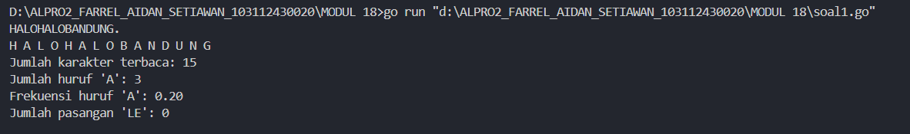

<h1 align=center>Laporan Praktikum MODUL 17. SKEMA PEMROSESAN SEKUENSIAL</h1>

<p align=center>Farrel Aidan Setiawan-103112430020</p>

## Dasar Teori

Model komputasi terdiri dari data yang dapat diolah dan operasi-operasi dasar pengolahan data tersebut. Mesin abstrak adalah model komputasi yang dirancang di atas model mesin komputasi yang telah ada, yaitu tipe data dan operasi-operasi dasarnya dibuat menggunakan tipe data dan operasi-operasi yang tersedia di mesin di bawahnya. Teknik ini merupakan salah satu cara untuk membangun perangkat lunak.

## Unguided

<h4>Soal 1</h4>
Implementasi mesin abstrak karakter yang bekerja terhadap untaian karakter (yang diakhiri dengan penanda titik (".") dan mempunyai sejumlah operasi dasar. 
a) Operasi dasar mesin karakter: 
➢ Prosedur start(); yang menyiapkan mesin karakter di awal rangkaian karakter. 
➢ Prosedur maju(); yang memajukan pembaca ke posisi karakter berikutnya. 
➢ Fungsi eop(); yang mengembalikan nilai true apabila sudah mencapai akhir rangkaian, sampai ke penanda titik ("."). 
➢ Fungsi cc(); yang mengembalikan karakter yang sedang terbaca, atau berada pada posisi pembacaan mesin. 
b) Dengan operasi dasar di atas buat algoritma untuk: 
➢ Membaca seluruh karakter yang diberikan ke mesin karakter tersebut. 
➢ Menghitung berapa banyak karakter yang terbaca. 
➢ Menghitung ada berapa huruf "A" yang terbaca. 
➢ Menghitung frekuensi kemunculan huruf "A" terhadap seluruh karakter terbaca. 
➢ Menghitung ada berapa kata "LE" (pasangan berturutan huruf "L" dan "E") yang terbaca.

```go
package main

import "fmt"

var input [100]byte
var panjang int
var posisi int
var kalimat byte

func start(teks string) {
    panjang = 0

    for i := 0; i < len(teks) && i < 100; i++ {
        input[i] = teks[i]
        panjang++
    }
    posisi = 0
    kalimat = input[posisi]
}

  
func maju() {
    posisi++
    if posisi < panjang {
        kalimat = input[posisi]
    }
}


func eop() bool {
    return kalimat == '.'
}

  
func cc() byte {
    return kalimat
}

  
func main() {
    var teks string
    var karakterAwal byte = 0
    var totalKarakter int = 0
    var jumlahA int = 0
    var jumlahLE int = 0
    
    fmt.Scan(&teks)

    if len(teks) == 0 || teks[len(teks)-1] != '.' {
        fmt.Println("Error, harus diakhiri dengan .")
        return
    }

    start(teks)

    for !eop() {
        c := cc()
        fmt.Printf("%c ", c)
        totalKarakter++

        if c == 'A' {
            jumlahA++
        }
        if karakterAwal == 'L' && c == 'E' {
            jumlahLE++
        }
        karakterAwal = c
        maju()
    }

    var frekuensiA float64 = 0
    if totalKarakter > 0 {
        frekuensiA = float64(jumlahA) / float64(totalKarakter)
    }
    
    fmt.Println("")
    fmt.Println("Jumlah karakter terbaca:", totalKarakter)
    fmt.Println("Jumlah huruf 'A':", jumlahA)
    fmt.Printf("Frekuensi huruf 'A': %.2f\n", frekuensiA)
    fmt.Println("Jumlah pasangan 'LE':", jumlahLE)
}
```

>**Output**
>

Program ini dibuat untuk membaca sebuah string yang diakhiri dengan tanda titik (.) dan melakukan analisis terhadap karakter-karakter di dalamnya. Analisis yang dilakukan meliputi pencetakan setiap karakter, menghitung jumlah total karakter yang terbaca, menghitung jumlah huruf 'A', menghitung frekuensi kemunculan huruf 'A' dibandingkan jumlah karakter, serta menghitung jumlah pasangan huruf 'L' yang langsung diikuti oleh huruf 'E'.

func main() mendeklarasikan beberapa variabel seperti teks bertipe data string untuk menampung input dari pengguna, karakterAwal bertipe data byte untuk menyimpan karakter sebelumnya saat membaca teks, totalKarakter bertipe data int untuk menghitung jumlah karakter terbaca, jumlahA bertipe data integer untuk menghitung banyaknya huruf A, dan jumlahLE bertipe data integer untuk menghitung jumlah pasangan 'LE'. Program terlebih dahulu membaca input lalu memeriksa apakah input tersebut diakhiri dengan tanda titik. Jika tidak, program akan mencetak pesan kesalahan dan berhenti.

Jika input valid, maka func start(teks string) akan dipanggil untuk menginisialisasi array karakter inputan, menyimpan panjang teks, dan menetapkan posisi awal pembacaan. Program kemudian menggunakan perulangan untuk membaca setiap karakter hingga ditemukan tanda titik sebagai akhir input. func maju() bertugas untuk memindahkan posisi pembacaan karakter ke karakter berikutnya, func eop() akan mengembalikan nilai true jika karakter yang sedang dibaca adalah tanda titik (.) dan false jika bukan, func cc() byte akan mengembalikan nilai dari kalimat, setelah selesai hasil akan ditampilkan semuanya
