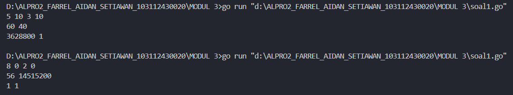
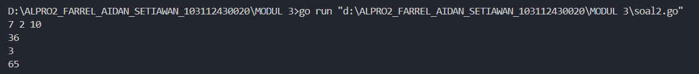
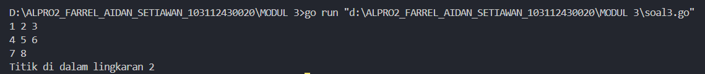

<h1 align=center>Laporan Praktikum Modul 3 <br>Fungsi</h1>

<p align=center>Farrel Aidan Setiawan-103112430020</p>

## Dasar Teori

Fungsi dalam pemrograman adalah suatu blok kode yang dirancang untuk melakukan tugas tertentu dan menghasilkan hasil dari proses tersebut.

## Unguided

<h4>Soal 1</h4>
Minggu ini, mahasiswa Fakultas Informatika mendapatkan tugas dari mata kuliah matematika diskrit untuk mempelajari kombinasi dan permutasi. Jonas salah seorang mahasiswa, iseng untuk mengimplementasikannya ke dalam suatu program. Oleh karena itu bersediakah kalian membantu Jonas? (tidak tentunya ya :p) 
Masukan terdiri dari empat buah bilangan asli 𝑎, 𝑏, 𝑐, dan 𝑑 yang dipisahkan oleh spasi, dengan syarat 𝑎 ≥ 𝑐 dan 𝑏 ≥ 𝑑. 
Keluaran terdiri dari dua baris. Baris pertama adalah hasil permutasi dan kombinasi 𝒂 terhadap 𝑐, sedangkan baris kedua adalah hasil permutasi dan kombinasi 𝑏 terhadap 𝑑. 
Catatan: permutasi (P) dan kombinasi (C) dari 𝑛 terhadap 𝑟 (𝑛 ≥ 𝑟) dapat dihitung dengan menggunakan persamaan berikut!

$$
𝑃(𝑛, 𝑟) = 𝑛! /(𝑛−𝑟)! , sedangkan 𝐶(𝑛, 𝑟) = 𝑛! /𝑟!(𝑛−𝑟)!
$$

```go
package main

import "fmt"

func faktorial(a int) int {
    if a == 0 || a == 1 {
        return 1
    }
    hasil := 1
    for i := 2; i <= a; i++ {
        hasil *= i
    }
    return hasil
}

func permutasi(a, b int) int {
    return faktorial(a) / faktorial(a-b)
}

func kombinasi(a, b int) int {
    return faktorial(a) / (faktorial)(b) * faktorial(a-b)
}

func main() {
    var a, b, c, d int
    fmt.Scan(&a, &b, &c, &d)

    fmt.Println(permutasi(a, c), kombinasi(a, c))
    fmt.Println(permutasi(b, d), kombinasi(b, d))
}
```

>**Output**
>

Program tersebut digunakan untuk menghitung permutasi dan kombinasi dari dua pasang bilangan yang dimasukkan oleh pengguna.

Program pertama tama akan mendeklarasikan fungsi faktorial bertipe data integer dengan variable a dengan tipe data integer, fungsi ini akan menghitung faktorial dari sebuah bilangan. Jika bilangan yang dimasukkan adalah 0 atau 1, maka fungsi akan langsung mengembalikan nilai 1. Jika lebih dari itu, fungsi akan melakukan perulangan dari angka 2 hingga bilangan tersebut dan mengalikan hasilnya secara berurutan untuk mendapatkan nilai faktorial.

Selanjutnya, program akan mendeklarasikan fungsi permutasi bertipe data integer dengan variable a dan b bertipedata integer, fungsi ini digunakan untuk menghitung permutasi dari dua bilangan dengan rumus seperti pada soal​, dan fungsi kombinasi bertipe data integer dengan variable a dan b yang bertipe data integer juga untuk menghitung kombinasi dari dua bilangan dengan rumus seperti pada soal. Setelah itu, program akan meminta input dari pengguna berupa empat bilangan yang dimana variablenya adalah a, b, c, d dengan tipe data integer. Program kemudian akan menampilkan hasil perhitungan permutasi dan kombinasi untuk masing-masing pasangan bilangan yang telah dimasukkan oleh pengguna.
<h4>Soal 2</h4>

Diberikan tiga buah fungsi matematika yaitu 𝑓 (𝑥) = 𝑥 2 , 𝑔 (𝑥) = 𝑥 − 2 dan ℎ (𝑥) = 𝑥 + 1. Fungsi komposisi (𝑓𝑜𝑔𝑜ℎ)(𝑥) artinya adalah 𝑓(𝑔(ℎ(𝑥))). Tuliskan 𝑓(𝑥), 𝑔(𝑥) dan ℎ(𝑥) dalam bentuk function. Masukan terdiri dari sebuah bilangan bulat 𝑎, 𝑏 dan 𝑐 yang dipisahkan oleh spasi. Keluaran terdiri dari tiga baris. Baris pertama adalah (𝑓𝑜𝑔𝑜ℎ)(𝑎), baris kedua (𝑔𝑜ℎ𝑜𝑓)(𝑏), dan baris ketiga adalah (ℎ𝑜𝑓𝑜𝑔)(𝑐)!

```go
package main

import "fmt"

func f(x int) int {
    return x * x
}
func g(x int) int {
    return x - 2
}
func h(x int) int {
    return x + 1
}

func main() {
    var a, b, c int
    fmt.Scan(&a, &b, &c)
  
    fmt.Println(f(g(h(a))))
    fmt.Println(g(h(f(b))))
    fmt.Println(h(f(g(c))))

}
```

>**Output**
>

Program tersebut digunakan untuk menghitung hasil dari tiga fungsi matematika yang saling bersarang, yaitu fungsi f, g, dan h, berdasarkan tiga input bilangan dari pengguna.

Program pertama tama akan mendeklarasikan tiga fungsi, yaitu f, g, dan h dengan tipe data integer dan masing masing memiliki variable x dengan tipe data integer juga. Fungsi f akan mengembalikan hasil kuadrat dari bilangan yang dimasukkan. Fungsi g akan mengembalikan hasil pengurangan bilangan dengan 2, sedangkan fungsi h akan mengembalikan hasil penjumlahan bilangan dengan 1.

Pada fungsi main, program mendeklarasikan tiga variabel bertipe integer, yaitu a, b, dan c, lalu meminta input dari pengguna untuk ketiga bilangan tersebut. Setelah menerima input, program akan menampilkan hasil dari tiga operasi fungsi bersarang. Operasi pertama adalah f(g(h(a))), yaitu menjalankan fungsi h terlebih dahulu pada a, kemudian hasilnya dimasukkan ke fungsi g, dan hasil akhirnya dikalkulasikan dengan fungsi f. Operasi kedua adalah g(h(f(b))), dan operasi ketiga adalah h(f(g(c))). Hasil dari ketiga operasi tersebut kemudian akan ditampilkan ke layar.
<h4>Soal 3</h4>
Suatu lingkaran didefinisikan dengan koordinat titik pusat (𝑐𝑥, 𝑐𝑦) dengan radius 𝑟. Apabila diberikan dua buah lingkaran, maka tentukan posisi sebuah titik sembarang (𝑥, 𝑦) berdasarkan dua lingkaran tersebut. 
Masukan terdiri dari beberapa tiga baris. Baris pertama dan kedua adalah koordinat titik pusat dan radius dari lingkaran 1 dan lingkaran 2, sedangkan baris ketiga adalah koordinat titik sembarang. Asumsi sumbu x dan y dari semua titik dan juga radius direpresentasikan dengan bilangan bulat. 
Keluaran berupa string yang menyatakan posisi titik "Titik di dalam lingkaran 1 dan 2", "Titik di dalam lingkaran 1", "Titik di dalam lingkaran 2", atau "Titik di luar lingkaran 1 dan 2".

```go
package main

import (
    "fmt"
    "math"
)

func jarak(a, b, c, d float64) float64 {
    return math.Sqrt(math.Pow(a-c, 2) + math.Pow(b-d, 2))
}

func didalam(cx, cy, r, x, y float64) bool {
    return jarak(cx, cy, x, y) <= r
}

func main() {
    var cx1, cy1, r1, cx2, cy2, r2, x, y float64
    var lingkaran1, lingkaran2 bool
    
    fmt.Scan(&cx1, &cy1, &r1)
    fmt.Scan(&cx2, &cy2, &r2)
    fmt.Scan(&x, &y)
  
    lingkaran1 = didalam(cx1, cy1, r1, x, y)
    lingkaran2 = didalam(cx2, cy2, r2, x, y)

    if lingkaran1 && lingkaran2 {
        fmt.Print("Titik di dalam lingkaran 1 dan 2")
    } else if lingkaran1 {
        fmt.Print("Titik di dalam lingkaran 1")
    } else if lingkaran2 {
        fmt.Print("Titik di dalam lingkaran 2")
    } else {
        fmt.Print("Titik di luar lingkaran 1 dan 2")
    }
}
```

>**Output**
>

Program tersebut digunakan untuk menentukan apakah sebuah titik berada di dalam salah satu atau kedua lingkaran berdasarkan input dari pengguna.

Program pertama tama mendeklarasikan fungsi jarak bertipe data float64 dan memiliki variable a, b, c, d dengan tipe data float64 juga untuk menghitung jarak antara dua titik dengan rumus math.Sqrt(math.Pow(a-c, 2) + math.Pow(b-d, 2))​. Kemudian, terdapat fungsi didalam dengan tipe data bool dan memiliki variable cx, cy, r, x, y dengan tipe data float64 yang memeriksa apakah suatu titik berada di dalam lingkaran dengan membandingkan jarak titik ke pusat lingkaran dengan jari-jari lingkaran.

Pada fungsi main terdapat variable cx1, cy1, r1, cx2, cy2, r2, x, y dengan tipe data float64 dan lingkaran1, lingkaran2 dengan tipe data bool, program ini meminta input dari pengguna berupa koordinat pusat dan jari-jari untuk dua lingkaran, serta koordinat titik yang akan diperiksa. Program kemudian memeriksa apakah titik tersebut berada di dalam masing-masing lingkaran. Hasil pemeriksaan akan dicetak sesuai kondisi yaitu apakah titik berada di dalam kedua lingkaran, salah satu lingkaran, atau di luar keduanya.
