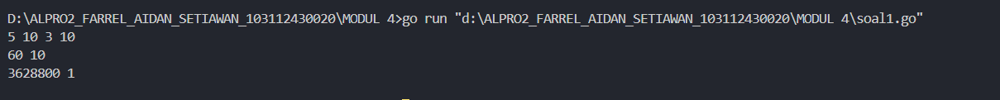
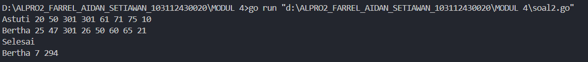
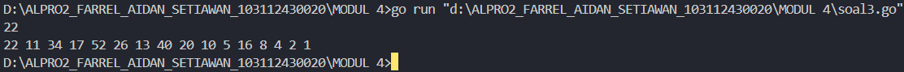

___
<h1 align=center>Laporan Praktikum Modul 4 <br>Prosedur</h1>
___
<p align=center>Farrel Aidan Setiawan-103112430020</p>
## Dasar Teori
___
Fungsi dalam pemrograman adalah suatu blok kode yang dirancang untuk melakukan tugas tertentu dan menghasilkan hasil dari proses tersebut.

## Unguided
___
<h4>Soal 1</h4>
Minggu ini, mahasiswa Fakultas Informatika mendapatkan tugas dari mata kuliah matematika diskrit untuk mempelajari kombinasi dan permutasi. Jonas salah seorang mahasiswa, iseng untuk mengimplementasikannya ke dalam suatu program. Oleh karena itu bersediakah kalian membantu Jonas? (tidak tentunya ya :p) 
Masukan terdiri dari empat buah bilangan asli 𝑎, 𝑏, 𝑐, dan 𝑑 yang dipisahkan oleh spasi, dengan syarat 𝑎 ≥ 𝑐 dan 𝑏 ≥ 𝑑. 
Keluaran terdiri dari dua baris. Baris pertama adalah hasil permutasi dan kombinasi 𝒂 terhadap 𝑐, sedangkan baris kedua adalah hasil permutasi dan kombinasi 𝑏 terhadap 𝑑. 
Catatan: permutasi (P) dan kombinasi (C) dari 𝑛 terhadap 𝑟 (𝑛 ≥ 𝑟) dapat dihitung dengan menggunakan persamaan berikut!
$$
𝑃(𝑛, 𝑟) = 𝑛! /(𝑛−𝑟)! , sedangkan 𝐶(𝑛, 𝑟) = 𝑛! /𝑟!(𝑛−𝑟)!
$$

```go
package main

import "fmt"

func faktorial(n int, hasil *int) {
    *hasil = 1
    for i := 2; i <= n; i++ {
        *hasil *= i
    }
}

func permutasi(n, r int, hasil *int) {
    var faktorial_n, faktorial_nr int
    faktorial(n, &faktorial_n)
    faktorial(n-r, &faktorial_nr)
    *hasil = faktorial_n / faktorial_nr
}

func kombinasi(n, r int, hasil *int) {
    var faktorial_n, faktorial_r, faktorial_nr int
    faktorial(n, &faktorial_n)
    faktorial(r, &faktorial_r)
    faktorial(n-r, &faktorial_nr)
    *hasil = faktorial_n / (faktorial_r * faktorial_nr)
}

func main() {
    var a, b, c, d int
    fmt.Scan(&a, &b, &c, &d)
    var permutasi_ac, kombinasi__ac, permutasi_bd, kombinasi_bd int
    permutasi(a, c, &permutasi_ac)
    kombinasi(a, c, &kombinasi__ac)
    permutasi(b, d, &permutasi_bd)
    kombinasi(b, d, &kombinasi_bd)

    fmt.Printf("%d %d\n", permutasi_ac, kombinasi__ac)
    fmt.Printf("%d %d\n", permutasi_bd, kombinasi_bd)

}
```

>**Output**
>

Program ini digunakan untuk menghitung permutasi dan kombinasi berdasarkan input pengguna. Prosedur faktorial yang memiliki dua variable n, r dengan tipe data integer akan menghitung faktorial dari suatu bilangan dengan melakukan perulangan dari 2 hingga n, menyimpan hasilnya melalui pointer. Prosedur permutasi yang memiliki variable n, r bertipe data integer akan menggunakan rumus permutasi untuk menghitung masukan, sementara prosedur kombinasi memiliki variable n, r bertipe data integer akan menghitung dengan menggunakan rumus kombinasi.

Pada fungsi main, program membaca empat bilangan a, b, c, dan d bertipe data integer dari input pengguna. Kemudian, program menghitung permutasi dan kombinasi untuk (a, c) dan (b, d), dengan menyimpan hasilnya dalam variabel permutasi_ac, kombinasi_ac, permutasi_bd dan kombinasi_bd bertipe data integer. Perhitungan dilakukan dengan memanggil prosedur permutasi dan kombinasi.

Hasil perhitungan permutasi dan kombinasi dicetak dalam dua baris menggunakan fmt.Printf, pada baris pertama akan menampilkan hasil untuk (a, c) dan baris kedua untuk (b, d).

<h4>Soal 2</h4>
Kompetisi pemrograman tingkat nasional berlangsung ketat. Setiap peserta diberikan 8 soal yang harus dapat diselesaikan dalam waktu 5 jam saja. Peserta yang berhasil menyelesaikan soal paling banyak dalam waktu paling singkat adalah pemenangnya. Buat program gema yang mencari pemenang dari daftar peserta yang diberikan. Program harus dibuat modular, yaitu dengan membuat prosedur hitungSkor yang mengembalikan total soal dan total skor yang dikerjakan oleh seorang peserta, melalui parameter formal. Pembacaan nama peserta dilakukan di program utama, sedangkan waktu pengerjaan dibaca di dalam prosedur. 
**prosedure hitungSkor(in/out soal, skor : integer)** 
Setiap baris masukan dimulai dengan satu string nama peserta tersebut diikuti dengan adalah 8 integer yang menyatakan berapa lama (dalam menit) peserta tersebut menyelesaikan soal. Jika tidak berhasil atau tidak mengirimkan jawaban maka otomatis dianggap menyelesaikan dalam waktu 5 jam 1 menit (301 menit). Satu baris keluaran berisi nama pemenang, jumlah soal yang diselesaikan, dan nilai yang diperoleh. Nilai adalah total waktu yang dibutuhkan untuk menyelesaikan soal yang berhasil diselesaikan.

```go
package main

import "fmt"

func hitungSkor(soal *int, skor *int) {
    var waktu [8]int
    *soal = 0
    *skor = 0
    for i := 0; i < 8; i++ {
        fmt.Scan(&waktu[i])
        if waktu[i] <= 300 {
            *soal++
            *skor += waktu[i]
        }
    }
}


func main() {
    var nama, pemenang string
    var soal, skor int

    max := -1
    min := 99999

  
    for {
        fmt.Scan(&nama)
        if nama == "Selesai" {
            break
        }
        hitungSkor(&soal, &skor)
        if soal > max || (soal == max && skor < min) {
            pemenang = nama
            max = soal
            min = skor
        }
    }
    fmt.Printf("%s %d %d\n", pemenang, max, min)
}
```

>**Output**
>

Program ini digunakan untuk menentukan peserta dengan jumlah soal terbanyak yang berhasil diselesaikan dalam waktu maksimal 300 detik dan mencatat total waktu terendah jika terdapat peserta dengan jumlah soal yang sama.

Prosedur hitungSkor yang memiliki variable soal dan skor dengan tipe data integer akan menerima pointer soal dan skor untuk menyimpan jumlah soal yang berhasil dikerjakan serta total waktu yang digunakan. Program membaca waktu penyelesaian 8 soal dari input dan hanya menambahkan soal serta waktu ke skor jika waktu penyelesaian tidak lebih dari 300 detik.

Pada fungsi main yang dimana terdapat variable soal, skor, nama, dan pemenang bertipe data integer, program akan membaca nama peserta secara berulang hingga input "Selesai" diberikan. Program akan memanggil hitungSkor untuk membandingkan hasil. Peserta yang memiliki jumlah soal lebih banyak atau jumlah soal yang sama tetapi dengan waktu total lebih kecil, maka peserta tersebut dicatat sebagai pemenang. Setelah semua peserta diproses, hasil pemenang, jumlah soal, dan total waktu ditampilkan.

<h4>Soal 3</h4>
Skiena dan Revilla dalam Programming Challenges mendefinisikan sebuah deret bilangan. Deret dimulai dengan sebuah bilangan bulat n. Jika bilangan n saat itu genap, maka suku berikutnya adalah ½n, tetapi jika ganjil maka suku berikutnya bernilai 3n+1. Rumus yang sama digunakan terus menerus untuk mencari suku berikutnya. Deret berakhir ketika suku terakhir bernilai 1. Sebagai contoh jika dimulai dengan n=22, maka deret bilangan yang diperoleh adalah:

**22 11 34 17 52 26 13 40 20 10 5 16 8 4 2 1**

Untuk suku awal sampai dengan 1000000, diketahui deret selalu mencapai suku dengan nilai 1. Buat program skiena yang akan mencetak setiap suku dari deret yang dijelaskan di atas untuk nilai suku awal yang diberikan. Pencetakan deret harus dibuat dalam prosedur cetakDeret yang mempunyai 1 parameter formal, yaitu nilai dari suku awal.

**prosedure cetakDeret(in n : integer )**

Masukan berupa satu bilangan integer positif yang lebih kecil dari 1000000. Keluaran terdiri dari satu baris saja. Setiap suku dari deret tersebut dicetak dalam baris yang dan dipisahkan oleh sebuah spasi.

```go
package main

import "fmt"


func deret(n int) {
    for n != 1 {
        fmt.Printf("%d ", n)
        if n%2 == 0 {
            n = n / 2
        } else {
            n = 3*n + 1
        }
    }
    fmt.Printf("1")
}

  

func main() {
    var n int
    fmt.Scan(&n)
    if n <= 0 || n >= 1000000 {
        fmt.Print("Bilangan harus positif dan kurang dari 1000000.")
        return
    }
    deret(n)
}
```

>**Output**
>

Program ini digunakan untuk menampilkan deret berdasarkan bilangan yang diberikan pengguna.

Fungsi deret yang memiliki variable n dengan tipe data integer akan menerima sebuah bilangan n dan mencetak deret yang dimana jika n genap, maka dibagi 2, jika ganjil maka dikalikan 3 dan ditambah 1. Proses ini berlanjut hingga n bernilai 1, di mana program mencetak angka 1 sebagai akhir dari deret.

Pada fungsi main yang terdapat variable n yang bertipe data integer, program akan membaca input n dan memastikan bahwa nilainya positif serta kurang dari 1000000. Jika tidak memenuhi syarat, program mencetak pesan kesalahan dan berhenti. Jika valid, fungsi deret dipanggil untuk mencetak deret berdasarkan nilai n.