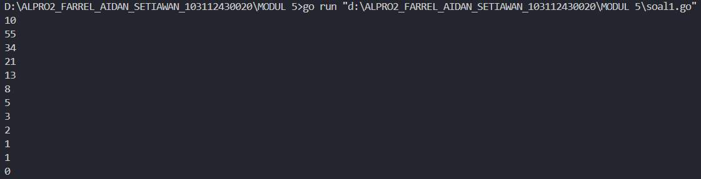
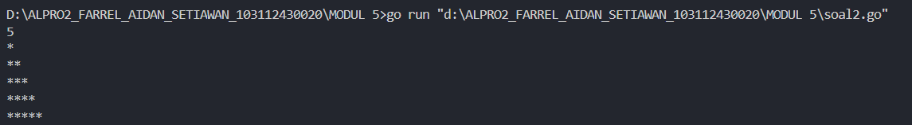
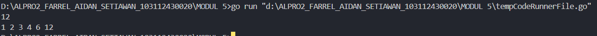
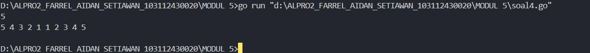
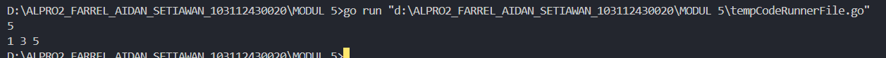
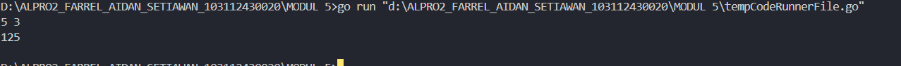

<h1 align=center>Laporan Praktikum Modul 5 <br>Rekursif</h1>

<p align=center>Farrel Aidan Setiawan-103112430020</p>

## Dasar Teori

Rekursif secara sederhana dapat diartikan sebagai cara menyelesaikan suatu masalah dengan cara menyelesaikan sub-masalah yang identik dari masalah utama.

## Unguided

<h4>Soal 1</h4>
Deret fibonacci adalah sebuah deret dengan nilai suku ke-0 dan ke-1 adalah 0 dan 1, dan nilai suku ke-n selanjutnya adalah hasil penjumlahan dua suku sebelumnya. Secara umum dapat diformulasikan $$𝑆𝑛 = 𝑆𝑛−1 + 𝑆𝑛−2$$ . Berikut ini adalah contoh nilai deret fibonacci hingga suku ke-10. Buatlah program yang mengimplementasikan fungsi rekursif pada deret fibonacci tersebut.


```go
package main

import "fmt"

func main() {
    var n int
    fmt.Scan(&n)
    hasil(n)
}

func fibonacci(n int) int {
    if n == 0 {
        return 0
    } else if n == 1 {
        return 1
    } else {
        return fibonacci(n-1) + fibonacci(n-2)
    }
}

func hasil(n int) {
    if n >= 0 {
        fmt.Println(fibonacci(n))
        hasil(n - 1)
    }
}
```

>**Output**
>

Program ini digunakan untuk menghitung dan mencetak bilangan fibonacci dari suatu bilangan input yang di berikan variable n dengan tipe data integer secara rekursif. func fibonacci(n int) int menghitung nilai ke n dalam deret fibonacci dengan metode rekursi, di mana jika n adalah 0 atau 1, fungsi mengembalikan nilai n. Untuk nilai yang lebih besar, digunakan fibonacci(n-1) + fibonacci(n-2).

func hasil(n int) untuk mencetak hasil perhitungan fibonacci dari n hingga 0. Jika n lebih besar atau sama dengan 0, maka program mencetak hasil dari fibonacci(n).

Pada fungsi main, program membaca satu bilangan bulat n dari input pengguna dan memanggil func hasil(n). Lalu program akan mencetak nilai fibonacci dari n hingga 0 menggunakan pendekatan rekursif.

<h4>Soal 2</h4>
Buatlah sebuah program yang digunakan untuk menampilkan pola bintang berikut ini dengan menggunakan fungsi rekursif. N adalah masukan dari user.

```go
package main

import "fmt"

func main() {
    var n int
    fmt.Scan(&n)
    pola(n, 1)
}

func pola(a, b int) {
    if b > a {
        return
    }
    bintang(b)
    fmt.Println()
    pola(a, b+1)
}

func bintang(n int) {
    if n == 0 {
        return
    }
    fmt.Print("*")
    bintang(n - 1)
}
```

>**Output**
>

Program ini digunakan untuk mencetak pola segitiga bintang secara rekursif berdasarkan input pengguna yang diberikan variable n dengan tipe data integer. Fungsi utama main membaca sebuah bilangan bulat n dari pengguna dan memanggil func pola(n, 1), yang akan mencetak baris-baris bintang dari 1 hingga n.

func pola(a, b int) bertugas mencetak barisan bintang secara bertahap. Jika b melebihi a, maka proses berhenti. Jika tidak, func bintang(b) dipanggil untuk mencetak b buah bintang pada baris tersebut, kemudian baris baru dibuat dengan fmt.Println(), dan pola(a, b+1) dipanggil untuk mencetak baris berikutnya.

func bintang(n int) bertugas mencetak n buah bintang dalam satu baris secara rekursif. Jika n mencapai 0, maka pencetakan berhenti. Jika tidak, satu bintang dicetak dengan fmt.Print(" * "), lalu bintang(n-1) dipanggil kembali hingga seluruh bintang pada baris tersebut tercetak.

<h4>Soal 3</h4>
Buatlah program yang mengimplementasikan rekursif untuk menampilkan faktor bilangan dari suatu N, atau bilangan yang apa saja yang habis membagi N. Masukan terdiri dari sebuah bilangan bulat positif N. Keluaran terdiri dari barisan bilangan yang menjadi faktor dari N (terurut dari 1 hingga N ya).

```go
package main

import "fmt"

func main() {
    var n int
    fmt.Scan(&n)
    faktor(n, 1)
}

func faktor(a, b int) {
    if b > a {
        return
    }
    if a%b == 0 {
        fmt.Printf("%d ", b)
    }
    faktor(a, b+1)
}
```

>**Output**
>

Program ini mencetak semua faktor dari bilangan yang diberikan pengguna yang di beri variable n dan bertipe data integer. Fungsi main membaca bilangan n dan memanggil faktor(n, 1), yang akan mencari serta mencetak faktor-faktor n secara rekursif.

func faktor(a, b int) memeriksa apakah b adalah faktor dari a. Jika b melebihi a, proses berhenti. Jika a habis dibagi b, nilai b dicetak. Kemudian, prosedur memanggil dirinya sendiri dengan faktor(a, b+1), hingga semua faktor ditemukan. Program ini secara bertahap mengecek dan mencetak faktor dari 1 hingga n dalam satu baris.

<h4>Soal 4</h4>
Buatlah program yang mengimplementasikan rekursif untuk menampilkan barisan bilangan tertentu. Masukan terdiri dari sebuah bilangan bulat positif N. Keluaran terdiri dari barisan bilangan dari N hingga 1 dan kembali ke N.

```go
package main

import "fmt"

func main() {
    var n int
    fmt.Scan(&n)
    bilangan(n)
    fmt.Println()
}

func bilangan(n int) {
    if n < 1 {
        return
    }
    fmt.Printf("%d ", n)
    bilangan(n - 1)
    fmt.Printf("%d ", n)
}
```

>**Output**
>

Program ini mencetak bilangan dari n ke 1, lalu kembali dari 1 ke n secara rekursif yang dimana variable n memiliki tipe data integer. Fungsi main membaca bilangan n dari pengguna dan memanggil func bilangan(n), lalu mencetak baris baru.

func bilangan(n int) mencetak n, lalu memanggil dirinya sendiri dengan n-1 hingga mencapai 1. Setelah mencapai batas dasar, proses kembali dan mencetak n lagi, membentuk pola simetris. Program mencetak bilangan secara menurun hingga 1, lalu naik kembali ke n, menghasilkan pola mirroring dalam satu baris.

<h4>Soal 5</h4>
Buatlah program yang mengimplementasikan rekursif untuk menampilkan barisan bilangan ganjil. Masukan terdiri dari sebuah bilangan bulat positif N. Keluaran terdiri dari barisan bilangan ganjil dari 1 hingga N.

```go
package main

import "fmt"

func main() {
    var n int
    fmt.Scan(&n)
    bilganjil(1, n)
}

func bilganjil(a, b int) {
    if a > b {
        return
    }
    fmt.Printf("%d ", a)
    bilganjil(a+2, b)
}
```

>**Output**
>

Program ini mencetak bilangan ganjil dari 1 hingga n secara rekursif dimana variable n memiliki tipe data integer. Fungsi main membaca bilangan n dari pengguna dan memanggil func bilganjil(1, n), yang akan mencetak bilangan ganjil dari 1 sampai n.

func bilganjil(a, b int) mencetak nilai a, lalu memanggil dirinya sendiri dengan a+2 selama a tidak melebihi b. Jika a lebih besar dari b, proses berhenti. Program mencetak bilangan ganjil secara berurutan hingga mencapai atau melewati batas n.

<h4>Soal 6</h4>
Buatlah program yang mengimplementasikan rekursif untuk mencari hasil pangkat dari dua buah bilangan. Masukan terdiri dari bilangan bulat x dan y. Keluaran terdiri dari hasil x dipangkatkan y. Catatan: diperbolehkan menggunakan asterik "*", tapi dilarang menggunakan import "math".

```go
package main

import "fmt"

func main() {
    var a, b int
    fmt.Scan(&a, &b)
    fmt.Printf("%d\n", pangkat(a, b))
}

func pangkat(a, b int) int {
    if b == 0 {
        return 1
    }
    return a * pangkat(a, b-1)
}
```

>**Output**
>

Program ini menghitung hasil perpangkatan suatu bilangan secara rekursif dimana variable n memiliki tipe data integer. Fungsi main membaca dua bilangan a dan b dari pengguna, lalu memanggil pangkat(a, b), yang mengembalikan hasil a^b dan mencetaknya.

func pangkat(a, b int) int menggunakan rekursi untuk menghitung a pangkat b. Jika b bernilai 0, maka akan mengembalikan ke 1. Jika tidak, maka akan mengembalikan hasil perkalian a dengan pangkat(a, b-1), yang terus berulang hingga b mencapai 0. Program ini menghitung perpangkatan dengan mengalikan a secara berulang sebanyak b kali, tanpa menggunakan operator pangkat bawaan.
