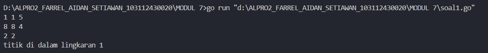
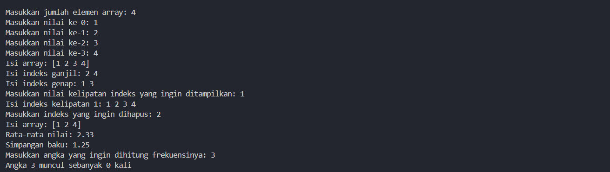
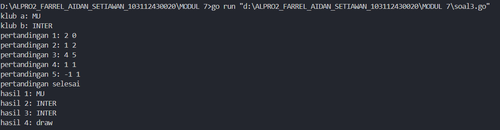
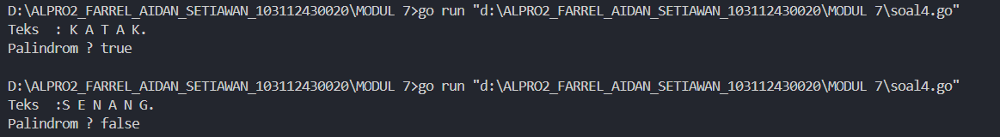

<h1 align=center>Laporan Praktikum Modul 7 <br>Struct Array</h1>

<p align=center>Farrel Aidan Setiawan-103112430020</p>

## Dasar Teori

Tipe bentukan memungkinkan pemrograman untuk mendefinisikan suatu tipe data baru pada suatu bahasa pemrograman. Tipe bentukan ini dapat dibedakan atas dua jenis, yaitu Alias dan Struct. Array mempunyai ukuran (jumlah elemen) yang tetap (statis) selama eksekusi program, sehingga jumlah elemen array menjadi bagian dari deklarasi variabel dengan tipe array.

## Unguided

<h4>Soal 1</h4>
Suatu lingkaran didefinisikan dengan koordinat titik pusat (𝑐𝑥, 𝑐𝑦) dengan radius 𝑟. Apabila diberikan dua buah lingkaran, maka tentukan posisi sebuah titik sembarang (𝑥, 𝑦) berdasarkan dua lingkaran tersebut. Gunakan tipe bentukan titik untuk menyimpan koordinat, dan tipe bentukan lingkaran untuk menyimpan titik pusat lingkaran dan radiusnya. 
Masukan terdiri dari beberapa tiga baris. Baris pertama dan kedua adalah koordinat titik pusat dan radius dari lingkaran 1 dan lingkaran 2, sedangkan baris ketiga adalah koordinat titik sembarang. Asumsi sumbu x dan y dari semua titik dan juga radius direpresentasikan dengan bilangan bulat. Keluaran berupa string yang menyatakan posisi titik "Titik di dalam lingkaran 1 dan 2", "Titik di dalam lingkaran 1", "Titik di dalam lingkaran 2", atau "Titik di luar lingkaran 1 dan 2".

```go
package main

import "fmt"

type titik struct {
    x, y int
}

type lingkaran struct {
    pusat    titik
    jarijari int
}

func didalam(l lingkaran, t titik) bool {
    jarakx := t.x - l.pusat.x
    jaraky := t.y - l.pusat.y
    jarakkuadrat := jarakx*jarakx + jaraky*jaraky
    jarijarikuadrat := l.jarijari * l.jarijari
    return jarakkuadrat <= jarijarikuadrat
}

func main() {
    var lingkaran1, lingkaran2 lingkaran
    var t titik

    fmt.Scan(&lingkaran1.pusat.x, &lingkaran1.pusat.y, &lingkaran1.jarijari)
    fmt.Scan(&lingkaran2.pusat.x, &lingkaran2.pusat.y, &lingkaran2.jarijari)
    fmt.Scan(&t.x, &t.y)
    dilingkaran1 := didalam(lingkaran1, t)
    dilingkaran2 := didalam(lingkaran2, t)

    if dilingkaran1 && dilingkaran2 {
        fmt.Println("titik di dalam lingkaran 1 dan 2")
    } else if dilingkaran1 {
        fmt.Println("titik di dalam lingkaran 1")
    } else if dilingkaran2 {
        fmt.Println("titik di dalam lingkaran 2")
    } else {
        fmt.Println("titik di luar lingkaran 1 dan 2")
    }
}
```

>**Output**
>

Program ini menentukan apakah suatu titik berada di dalam satu atau dua lingkaran. Struct titik memiliki variabel x dan y bertipe data integer, yang menyimpan koordinat titik tersebut. Sedangkan struct lingkaran memiliki variabel pusat, yang bertipe data titik untuk menyimpan koordinat pusat lingkaran, serta variabel jarijari bertipe data integer untuk menyimpan jari-jari lingkaran.

Fungsi didalam(c lingkaran, p titik) bool menghitung jarak antara titik p dan pusat lingkaran c dengan menggunakan rumus jarak Euclidean, kemudian membandingkannya dengan jari-jari lingkaran. Fungsi ini mengembalikan true jika titik berada di dalam lingkaran (jaraknya lebih kecil atau sama dengan jari-jari lingkaran), dan false jika tidak.

Pada fungsi main(), program memiliki dua variabel lingkaran1 dan lingkaran2 yang bertipe data lingkaran, dan satu variabel t yang bertipe data titik. Program kemudian memeriksa posisi titik t terhadap kedua lingkaran menggunakan fungsi didalam(). Berdasarkan hasil pemeriksaan, program mencetak apakah titik berada di dalam kedua lingkaran, salah satu lingkaran, atau di luar keduanya.

<h4>Soal 2</h4>
function jarak(p, q : titik) -> real {Mengembalikan jarak antara titik p(x,y) dan titik q(x,y)} function didalam(c:lingkaran, p:titik) -> boolean {Mengembalikan true apabila titik p(x,y) berada di dalam lingkaran c yang memiliki titik pusat (cx,cy) dan radius r}

Sebuah array digunakan untuk menampung sekumpulan bilangan bulat. Buatlah program yang digunakan untuk mengisi array tersebut sebanyak N elemen nilai. Asumsikan array memiliki kapasitas penyimpanan data sejumlah elemen tertentu. Program dapat menampilkan beberapa informasi berikut: 
a. Menampilkan keseluruhan isi dari array. 
b. Menampilkan elemen-elemen array dengan indeks ganjil saja. 
c. Menampilkan elemen-elemen array dengan indeks genap saja (asumsi indek ke-0 adalah genap). 
d. Menampilkan elemen-elemen array dengan indeks kelipatan bilangan x. x bisa diperoleh dari masukan pengguna. 
e. Menghapus elemen array pada indeks tertentu, asumsi indeks yang hapus selalu valid. Tampilkan keseluruhan isi dari arraynya, pastikan data yang dihapus tidak tampil 
f. Menampilkan rata-rata dari bilangan yang ada di dalam array. 
g. Menampilkan standar deviasi atau simpangan baku dari bilangan yang ada di dalam array tersebut. 
h. Menampilkan frekuensi dari suatu bilangan tertentu di dalam array yang telah diisi tersebut.

```go
package main

import (
    "fmt"
    "math"
)

type Titik struct {
    x, y float64
}

type Lingkaran struct {
    pusat Titik
    jari2 float64
}

func hitungJarak(t1, t2 Titik) float64 {
    selisihX := t1.x - t2.x
    selisihY := t1.y - t2.y
    return math.Sqrt(selisihX*selisihX + selisihY*selisihY)
}


func titikDiDalamLingkaran(l Lingkaran, t Titik) bool {
    jarak := hitungJarak(l.pusat, t)
    return jarak <= l.jari2
}

func tampilkanSemua(arr []int) {
    fmt.Println("Isi array:", arr)
}

func tampilkanIndeksGanjil(arr []int) {
    fmt.Print("Isi indeks ganjil: ")
    for i := 1; i < len(arr); i += 2 {
        fmt.Print(arr[i], " ")
    }
    fmt.Println()
}
  

func tampilkanIndeksGenap(arr []int) {
    fmt.Print("Isi indeks genap: ")
    for i := 0; i < len(arr); i += 2 {
        fmt.Print(arr[i], " ")
    }
    fmt.Println()
}


func tampilkanIndeksKelipatan(arr []int, x int) {
    fmt.Printf("Isi indeks kelipatan %d: ", x)
    for i := 0; i < len(arr); i++ {
        if i%x == 0 {
            fmt.Print(arr[i], " ")
        }
    }
    fmt.Println()
}

  
func hapusDataPadaIndeks(arr []int, index int) []int {
    return append(arr[:index], arr[index+1:]...)
}

  
func hitungRataRata(arr []int) float64 {
    total := 0
    for _, nilai := range arr {
        total += nilai
    }
    return float64(total) / float64(len(arr))
}

  
func hitungSimpanganBaku(arr []int) float64 {
    rata := hitungRataRata(arr)
    total := 0.0
    for _, nilai := range arr {
        selisih := float64(nilai) - rata
        total += selisih * selisih
    }
    return math.Sqrt(total / float64(len(arr)))
}


func hitungFrekuensi(arr []int, target int) int {
    jumlah := 0
    for _, nilai := range arr {
        if nilai == target {
            jumlah++
        }
    }
    return jumlah
}

  
func main() {

    var jumlah int
    fmt.Print("Masukkan jumlah elemen array: ")
    fmt.Scan(&jumlah)

    data := make([]int, jumlah)
    for i := 0; i < jumlah; i++ {
        fmt.Printf("Masukkan nilai ke-%d: ", i)
        fmt.Scan(&data[i])
    }

  
    tampilkanSemua(data)
    tampilkanIndeksGanjil(data)
    tampilkanIndeksGenap(data)


    var kelipatan int
    fmt.Print("Masukkan nilai kelipatan indeks yang ingin ditampilkan: ")
    fmt.Scan(&kelipatan)
    tampilkanIndeksKelipatan(data, kelipatan)

  
    var hapusIndex int
    fmt.Print("Masukkan indeks yang ingin dihapus: ")
    fmt.Scan(&hapusIndex)
    data = hapusDataPadaIndeks(data, hapusIndex)
    tampilkanSemua(data)


    fmt.Printf("Rata-rata nilai: %.2f\n", hitungRataRata(data))
    fmt.Printf("Simpangan baku: %.2f\n", hitungSimpanganBaku(data))


    var dicari int
    fmt.Print("Masukkan angka yang ingin dihitung frekuensinya: ")
    fmt.Scan(&dicari)
    fmt.Printf("Angka %d muncul sebanyak %d kali\n", dicari, hitungFrekuensi(data, dicari))
}
```

>**Output**
>

Program ini terdiri dari type Titik struct {x, y float64} digunakan untuk menyimpan koordinat dalam bidang datar dengan dua nilai x dan y, sedangkan type Lingkaran struct {pusat Titik jari2 float64} merepresentasikan sebuah lingkaran yang memiliki titik pusat  dan jari-jari. func hitungJarak(t1, t2 Titik) float64 digunakan untuk menghitung jarak antara dua titik dengan rumus, dan func titikDiDalamLingkaran(l Lingkaran, t Titik) bool mengecek apakah suatu titik berada di dalam atau tepat pada lingkaran dengan membandingkan jaraknya ke pusat dengan jari jari lingkaran.

Untuk bagian array, func tampilkanSemua(arr []int) mencetak seluruh elemen array, func tampilkanIndeksGanjil(arr []int) menampilkan elemen dengan indeks ganjil, dan func tampilkanIndeksGenap(arr []int) untuk indeks genap. func tampilkanIndeksKelipatan(arr []int, x int) mencetak elemen yang berada pada indeks kelipatan dari suatu nilai yang dimasukkan pengguna. func hapusDataPadaIndeks(arr []int, index int) []int digunakan untuk menghapus elemen array pada indeks tertentu, func hitungRataRata(arr []int) float64 menghitung nilai rata-rata elemen array, sedangkan func hitungSimpanganBaku(arr []int) float64 menghitung simpangan baku dari data tersebut. func hitungFrekuensi(arr []int, target int) int menghitung jumlah kemunculan suatu angka dalam array. func main() yang menerima input dari pengguna dan menampilkan hasil sesuai permintaan.
<h4>Soal 3</h4>
Sebuah program digunakan untuk menyimpan dan menampilkan nama-nama klub yang memenangkan pertandingan bola pada suatu grup pertandingan. Buatlah program yang digunakan untuk merekap skor pertandingan bola 2 buah klub bola yang berlaga. Pertama-tama program meminta masukan nama-nama klub yang bertanding, kemudian program meminta masukan skor hasil pertandingan kedua klub tersebut. Yang disimpan dalam array adalah nama-nama klub yang menang saja. Proses input skor berhenti ketika skor salah satu atau kedua klub tidak valid (negatif). Di akhir program, tampilkan daftar klub yang memenangkan pertandingan.

```go
package main

import "fmt"

type pertandingan struct {
    klub_a, klub_b string
    skor_a, skor_b  int

}

func main() {

    var klub_a, klub_b string
    var daftar_pemenang []string
    var pertandingan_ke int = 1

    fmt.Print("klub a: ")
    fmt.Scan(&klub_a)
    fmt.Print("klub b: ")
    fmt.Scan(&klub_b)

    for {

        var skor_a, skor_b int

        fmt.Printf("pertandingan %d: ", pertandingan_ke)
        fmt.Scan(&skor_a, &skor_b)
        
        if skor_a < 0 || skor_b < 0 {
            break
        }

        if skor_a > skor_b {
            daftar_pemenang = append(daftar_pemenang, klub_a)
        } else if skor_b > skor_a {
            daftar_pemenang = append(daftar_pemenang, klub_b)
        } else {
            daftar_pemenang = append(daftar_pemenang, "draw")
        }
        pertandingan_ke++
    }

    fmt.Println("pertandingan selesai")
    for i, pemenang := range daftar_pemenang {
        fmt.Printf("hasil %d: %s\n", i+1, pemenang)
    }
}
```

>**Output**
>

Program ini digunakan untuk merekam hasil pertandingan antara dua klub bola. Struct pertandingan memiliki variabel klub_a dan klub_b bertipe data string, serta skor_a dan skor_b bertipe data integer.

func main() pertama-tama meminta input nama kedua klub yang bertanding, yaitu klub_a dan klub_b. Kemudian, akan loop untuk meminta input skor pertandingan antara kedua klub. Setelah skor dimasukkan, program membandingkan skor kedua klub untuk menentukan pemenangnya. Jika skor klub A lebih tinggi, maka nama klub_a ditambahkan ke dalam daftar pemenang. Jika skor klub B lebih tinggi, maka klub_b dimasukkan ke dalam daftar pemenang. Jika skor kedua klub sama, hasilnya adalah "draw" dan ditambahkan ke dalam daftar pemenang.

Proses ini terus berlanjut hingga skor negatif dimasukkan, yang menandakan akhir dari input pertandingan. Setelah itu, program akan mencetak hasil dari setiap pertandingan yang telah diinputkan, menampilkan klub yang menang atau "draw" jika hasilnya imbang. Program kemudian menampilkan daftar hasil dan mengakhiri proses.

<h4>Soal 4</h4>
Sebuah array digunakan untuk menampung sekumpulan karakter, Anda diminta untuk membuat sebuah subprogram untuk melakukan membalikkan urutan isi array dan memeriksa apakah membentuk palindrom. Lengkapi potongan algoritma berikut ini!

```go
package main
import "fmt"

const NMAX int = 127

type tabel [NMAX]rune

func isiArray(t *tabel, n *int) {
    var kata rune
    *n = 0
    for {
        fmt.Scanf("%c", &ch)
        if kata == '.' || *n >= NMAX {
            break
        }
        if kata != ' ' && kata != '\n' {
            t[*n] = kata
            *n++
        }
    }
}

func cetakArray(t tabel, n int) {
    fmt.Print("  ")
    for i := 0; i < n; i++ {
        fmt.Printf("%c ", t[i])
    }
    fmt.Println()
}

func balikanArray(t *tabel, n int) {
    for i := 0; i < n/2; i++ {
        t[i], t[n-1-i] = t[n-1-i], t[i]
    }
}

func palindrom(t tabel, n int) bool {
    for i := 0; i < n/2; i++ {
        if t[i] != t[n-1-i] {
            return false
        }
    }
    return true
}

func main() {
    var tab tabel
    var m int

    fmt.Print("Teks  :")
    isiArray(&tab, &m)

    fmt.Print("Palindrom ? ")
    fmt.Println(palindrom(tab, m))

}
```

>**Output**
>

Program ini digunakan untuk membaca deretan karakter dari input pengguna dan menyimpannya ke dalam array bertipe rune. Pembacaan dilakukan karakter demi karakter menggunakan func isiArray(t * tabel, n * int), dan akan berhenti saat ditemukan tanda titik (.) atau jumlah karakter mencapai batas maksimum yaitu 127. func isiArray(t * tabel, n * int) akan menghitung jumlah karakter yang berhasil dimasukkan ke dalam array dengan variable n bertipe data int.

func palindrom(t tabel, n int) bool akan memeriksa apakah deretan karakter tersebut merupakan palindrom, yaitu susunan karakter yang jika dibaca dari depan dan belakang tetap sama. Pemeriksaan dilakukan dengan membandingkan karakter dari ujung kiri dan kanan menuju tengah. Jika seluruh pasangan karakter cocok, maka fungsi mengembalikan true, dan jika ditemukan satu saja pasangan yang berbeda, fungsi langsung mengembalikan false. func balikanArray(t * tabel, n int) berfungsi untuk membalik urutan isi array, dengan menukar elemen dari ujung ke ujung secara berpasangan

Pada func main(), program memulai dengan mendeklarasikan array tab dan variabel penghitung m. Setelah meminta input pengguna, program menjalankan func isiArray(t * tabel, n * int) untuk mengisi array, lalu memanggil func palindrom(t tabel, n int) untuk mengecek apakah input tersebut adalah palindrom. Hasil pengecekan dicetak ke layar sebagai true jika palindrom, dan false jika tidak.
