___
<h1 align=center>Laporan Praktikum Modul X <br>Nama Modul</h1>
___
<p align=center>Farrel Aidan Setiawan-103112430020</p>
## Dasar Teori
___
Latihan dan review penggunaan IF-THEN, SWITCH, TIPE DATA DAN VARIABLE, LOOPING, REPEAT UNTIL, WHILE LOOP

## Unguided

<h4>Soal 1</h4>
Telusuri program berikut dengan cara mengkompilasi dan mengeksekusi program. Silakan masukan data yang sesuai sebanyak yang diminta program. Perhatikan keluaran yang diperoleh. Coba terangkan apa sebenarnya yang dilakukan program tersebut?

``` go
package main
import "fmt"
  
func main() {
    var (
        satu, dua, tiga string
        temp            string
    )
    fmt.Print("Masukan input string: ")
    fmt.Scanln(&satu)
    fmt.Print("Masukan input string: ")
    fmt.Scanln(&dua)
    fmt.Print("Masukan input string: ")
    fmt.Scanln(&tiga)
    fmt.Println("Output awal = " + satu + " " + dua + " " + tiga)

    temp = satu
    satu = dua
    dua = tiga
    tiga = tem
    fmt.Println("Output akhir = " + satu + " " + dua + " " + tiga)

}
```

>**Output**
>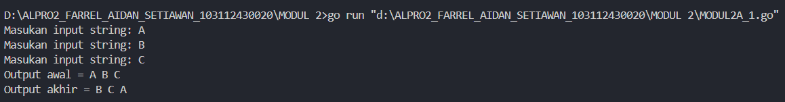


Program tersebut akan menukar nilai dari variable “satu”, “dua”, “tiga”, “temp” yang dimasukan pengguna.

Program pertama tama akan mendeklarasikan variable “satu”, “dua”, “tiga”, “temp” dengan tipe data string lalu mengeksekusi dan menampilkan output awal yang terdiri dari masukan untuk variable “satu”, “dua”, dan “tiga” secara berurutan, setelah itu program akan menukar nilai masukan dengan cara masukan variable “satu” ditukar ke “temp” (agar ada nilainya), “satu” ditukar ke “dua”, “dua” ditukar ke “tiga”, “tiga” ditukar ke “temp”, dengan ini nilai yang dimasukan ke variable “satu” akan berada di variable “tiga”, “dua” akan berada di “satu”, “tiga” akan berada di ”dua”, dan hasilnya akan ditampilkan.

Contoh: A B C > B C A

<h4>Soal 2</h4>
Tahun kabisat adalah tahun yang habis dibagi 400 atau habis dibagi 4 tetapi tidak habis dibagi 100. Buatlah sebuah program yang menerima input sebuah bilangan bulat dan memeriksa apakah bilangan tersebut merupakan tahun kabisat (true) atau bukan (false).

```go
package main
import "fmt"

func main() {
    var tahun int
    fmt.Print("Tahun: ")
    fmt.Scan(&tahun)
    if tahun%4 == 0 && (tahun%100 != 0 || tahun%400 == 0) {
        fmt.Println("kabisat:", true)
    } else {
        fmt.Println("kabisat:", false)
    }
}
```

>**Output**
>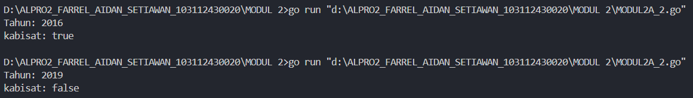


Program tersebut akan menentukan apakah suatu tahun yang dimasukkan oleh pengguna merupakan tahun kabisat atau bukan.

Program pertama tama akan mendekalrasikan variable "tahun" dengan tipe data integer lalu mengeksekusi dan menampilkan output awal berupa perintah kepada pengguna untuk memasukkan nilai tahun. Setelah pengguna memasukkan angka tahun, program akan melakukan pengecekan dengan rumus yang dimana tahun dikatakan kabisat jika habis dibagi 4, namun jika tahun tersebut juga habis dibagi 100, maka tahun tersebut bukan kabisat, kecuali jika habis dibagi 400 juga maka merupakan tahun kabisat.

Jika kondisi tersebut terpenuhi, maka program akan mencetak "kabisat: true", yang berarti tahun tersebut adalah tahun kabisat. Jika tidak, maka program akan mencetak "kabisat: false", yang berarti bukan tahun kabisat.

<h4>Soal 3</h4>
Buat program Bola yang menerima input jari jari suatu bola (bilangan bulat). Tampilkan Volume dan Luas kulit bola. 𝑣𝑜𝑙𝑢𝑚𝑒𝑏𝑜𝑙𝑎 = 4/3 𝜋𝑟^3 dan 𝑙𝑢𝑎𝑠𝑏𝑜𝑙𝑎 = 4𝜋𝑟^2 (π ≈ 3.1415926535).

```go
package main
import "fmt" 

func main() {
    var jari int
    var vol, luas float64

    fmt.Print("Jejari: ")
    fmt.Scan(&jari)  

    conv := float64(jari)
    pi := 3.141592653589793

    vol = (4.0 / 3.0) * pi * conv * conv * conv
    luas = 4 * pi * conv * conv

    fmt.Printf("Bola dengan jejari memiliki volume %.4f dan luas kulit %.4f", vol, luas)

}
```

>**Output**
>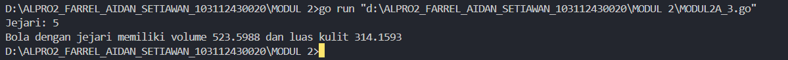


Program tersebut akan menghitung volume dan luas permukaan bola berdasarkan nilai jejari yang dimasukkan oleh pengguna.

Program pertama tama akan mendeklarasikan variable "jari" dengan tipe data integer, "vol" dan "luas" float lalu mengeksekusi dan menampilkan output awal berupa perintah kepada pengguna untuk memasukkan nilai jejari. Setelah pengguna memasukkan angka, program akan mengonversi masukan ke tipe data float64, setelah itu akan dihitung menggunakan rumus volume bola = 4/3 𝜋𝑟^3 dan luas bola = 4𝜋𝑟^2 (π ≈ 3.1415926535).

Setelah nilai dihitung menggunakan rumus tersebut, hasilnya akan ditampilkan dalam format desimal dengan 4 angka di belakang koma.

<h4>Soal 4</h4>
Dibaca nilai temperatur dalam derajat Celsius. Nyatakan temperatur tersebut dalam Fahrenheit 𝐶𝑒𝑙𝑠𝑖𝑢𝑠 = (𝐹𝑎ℎ𝑟𝑒𝑛ℎ𝑒𝑖𝑡 − 3/2) × 5/9 𝑅𝑒𝑎𝑚𝑢𝑟 = 𝐶𝑒𝑙𝑐𝑖𝑢𝑠 × 4/5 𝐾𝑒𝑙𝑣𝑖𝑛 = (𝐹𝑎ℎ𝑟𝑒𝑛ℎ𝑒𝑖𝑡 + 459.67) × 5/9

```go
package main
import "fmt"

func main() {
    var cel, ream, fahr, kelv float64
 
    fmt.Print("Temperatur Celsius: ")
    fmt.Scan(&cel)

    ream = cel * 4 / 5
    fahr = (cel * 9 / 5) + 32
    kelv = cel + 273.15
    
    fmt.Printf("Derajat Reamur: %.2f\n", ream)
    fmt.Printf("Derajat Fahrenheit: %.2f\n", fahr)
    fmt.Printf("Derajat Kelvin: %.2f\n", kelv)

}
```

>**Output**
>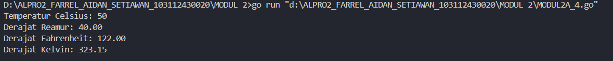


Program tersebut akan mengonversi suhu dari Celsius ke tiga skala suhu lainnya: Reamur, Fahrenheit, dan Kelvin.

Program pertama tama akan mendeklarasikan variable "cel", "ream", "fahr", "kelv" dengan tipe data float lalu mengeksekusi dan menampilkan output awal berupa perintah kepada pengguna untuk memasukkan nilai suhu dalam Celsius. Setelah pengguna memasukkan angka, program akan menghitung nilai suhu dalam skala lainnya menggunakan rumus 
𝐶𝑒𝑙𝑠𝑖𝑢𝑠 = (𝐹𝑎ℎ𝑟𝑒𝑛ℎ𝑒𝑖𝑡 − 3/2) × 5/9 𝑅𝑒𝑎𝑚𝑢𝑟 = 𝐶𝑒𝑙𝑐𝑖𝑢𝑠 × 4/5 𝐾𝑒𝑙𝑣𝑖𝑛 = (𝐹𝑎ℎ𝑟𝑒𝑛ℎ𝑒𝑖𝑡 + 459.67) × 5/9

Setelah nilai dihitung menggunakan rumus tersebut, hasilnya akan ditampilkan dalam format desimal dengan 2 angka di belakang koma.

<h4>Soal 5</h4>
Tipe karakter sebenarnya hanya apa yang tampak dalam tampilan. Di dalamnya tersimpan dalam bentuk biner 8 bit (byte) atau 32 bit (rune) saja. Buat program ASCII yang akan membaca 5 buat data integer dan mencetaknya dalam format karakter. Kemudian membaca 3 buah data karakter dan mencetak 3 buah karakter setelah karakter tersebut (menurut tabel ASCII).

Masukan terdiri dari dua baris. Baris pertama berisi 5 buah data integer. Data integer mempunyai nilai antara 32 s.d. 127. Baris kedua berisi 3 buah karakter yang berdampingan satu dengan yang lain (tanpa dipisahkan spasi). 

Keluaran juga terdiri dari dua baris. Baris pertama berisi 5 buah representasi karakter dari data yang diberikan, yang berdampingan satu dengan lain, tanpa dipisahkan spasi. Baris kedua berisi 3 buah karakter (juga tidak dipisahkan oleh spasi).

```go
package main
import "fmt"

func main() {
    var c1, c2, c3, c4, c5 byte
    var b1, b2, b3 int

    fmt.Scan(&c1, &c2, &c3, &c4, &c5)
    fmt.Scanf("%c", &b1)
    fmt.Scanf("%c", &b2)
    fmt.Scanf("%c", &b3)
    
    fmt.Printf("%c%c%c%c%c", c1, c2, c3, c4, c5)
    fmt.Printf("%c%c%c", b1+1, b2+1, b3+1)

}
```

>**Output**
>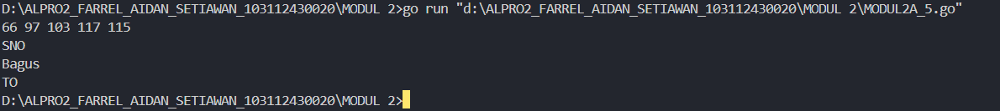
>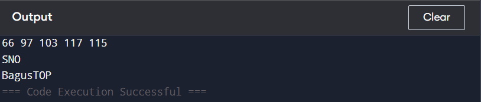
>(hasil eksekusi program harusnya SNO -> TOP namun compiler saya tidak mengeksekusi dengan bener sedangkan di compiler online benar) 


Program tersebut akan membaca lima angka pertama sebagai masukan awal, lalu membaca tiga karakter tambahan, dan mencetak hasilnya dengan beberapa modifikasi.

Program pertama tama akan mengeksekusi dan meminta pengguna untuk memasukkan lima angka, yang kemudian akan disimpan dalam variabel "c1", "c2", "c3", "c4", dan "c5" yang memiliki tipe data byte. Setelah itu, program akan membaca tiga karakter tambahan dan menyimpannya dalam variabel "b1", "b2", dan "b3" yang memiliki tipe data integer.

Setelah semua nilai diperoleh, program akan mencetak lima angka pertama dalam bentuk karakter ASCII sesuai dengan nilainya. Selanjutnya, tiga karakter tambahan akan ditampilkan dengan nilai ASCII yang ditambahkan 1 dari nilai aslinya. Dengan masukan `"66 97 103 117 115"` diikuti oleh "SNO" hasil akhirnya adalah "Bagus" dan "TOP", di mana "Bagus" berasal dari konversi ASCII angka pertama, sedangkan "TOP" berasal dari "SNO" yang telah ditambah 1 dalam nilai ASCII. 

<h4>Soal 6</h4>
Siswa kelas IPA di salah satu sekolah menengah atas di Indonesia sedang mengadakan praktikum kimia. Di setiap percobaan akan menggunakan 4 tabung reaksi, yang mana susunan warna cairan di setiap tabung akan menentukan hasil percobaan. Siswa diminta untuk mencatat hasil percobaan tersebut. Percobaan dikatakan berhasil apabila susunan warna zat cair pada gelas 1 hingga gelas 4 secara berturutan adalah ‘merah’, ‘kuning’, ‘hijau’, dan ‘ungu’ selama 5 kali percobaan berulang. Buatlah sebuah program yang menerima input berupa warna dari ke 4 gelas reaksi sebanyak 5 kali percobaan. Kemudian program akan menampilkan true apabila urutan warna sesuai dengan informasi yang diberikan pada paragraf sebelumnya, dan false untuk urutan warna lainnya.

```go
package main
import "fmt"

func main() {
    masukan := []string{"merah", "kuning", "hijau", "ungu"}
    benar := true

    for i := 1; i <= 5; i++ {
        fmt.Printf("Percobaan %d: ", i)
        var a, b, c, d string
        fmt.Scan(&a, &b, &c, &d)
        
        if a != masukan[0] || b != masukan[1] || c != masukan[2] || d != masukan[3] {
            benar = false
        }
    }

    fmt.Printf("BERHASIL: %t\n", benar)

}
```

>**Output**
>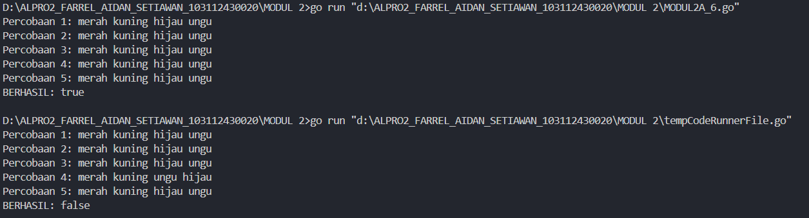


Program tersebut akan meminta pengguna untuk memasukkan empat warna dalam lima percobaan dan mengevaluasi apakah semua masukan sesuai dengan daftar warna yang telah ditentukan.

Program pertama tama akan mendeklarasikan sebuah slice masukan yang berisi warna "merah", "kuning", "hijau", dan "ungu", dengan tipe data string dan variabel "benar" yang ditetapkan dengan nilai true. Setelah itu, program akan menjalankan perulangan sebanyak lima kali untuk meminta pengguna memasukkan empat warna. Setiap kali pengguna memasukkan warna, program akan membandingkan masukan tersebut dengan daftar warna yang telah ditentukan. Jika ada satu saja yang tidak sesuai, variabel benar akan diubah menjadi false.

Setelah lima percobaan selesai, program akan mencetak "BERHASIL: true" jika semua masukan dalam setiap percobaan benar, atau "BERHASIL: false" jika ada kesalahan pada salah satu percobaan hasilnya akan "BERHASIL: false".

<h4>Soal 7</h4>
Suatu pita (string) berisi kumpulan nama-nama bunga yang dipisahkan oleh spasi dan ‘– ‘, contoh pita diilustrasikan seperti berikut ini. Pita: mawar – melati – tulip – teratai – kamboja – anggrek Buatlah sebuah program yang menerima input sebuah bilangan bulat positif (dan tidak nol) N, kemudian program akan meminta input berupa nama bunga secara berulang sebanyak N kali dan nama tersebut disimpan ke dalam pita.

Modifikasi program sebelumnya, proses input akan berhenti apabila user mengetikkan ‘SELESAI’. Kemudian tampilkan isi pita beserta banyaknya bunga yang ada di dalam pita

```go
package main
import (
    "fmt"
    "strings"
)

func main() {

    var bunga string
    var input string

    count := 0
    
    for {
        count++
        fmt.Printf("Bunga %d : ", count)
        fmt.Scan(&input)
        if input == "SELESAI" {
            if bunga == "" {
                fmt.Print("Pita :")
                fmt.Print("Bunga: 0")
            } else {
                fmt.Print("Pita:", bunga)
                fmt.Print("Bunga:", len(strings.Split(bunga, " - ")))
            }
            break
        }
        if bunga != "" {
            bunga += input + " - "
        } else {
            bunga = input
        }
    }
}
```

>**Output**
>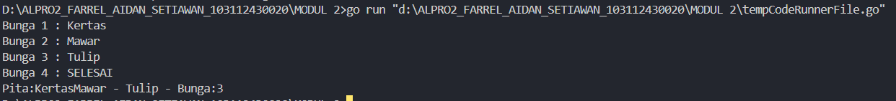


Program tersebut akan meminta pengguna untuk memasukkan nama bunga secara berulang hingga mengetik "SELESAI", lalu menampilkan daftar bunga yang dimasukkan beserta jumlahnya.

Program pertama tama akan mendeklarasikan variabel "bunga" dengan tipe data string untuk menyimpan daftar bunga, dan "input" dengan tipe data string untuk menerima masukan, dan "count" sebagai jumlah awal. Program kemudian menjalankan perulangan tak terbatas yang akan meminta pengguna memasukkan nama bunga satu per satu. Jika pengguna mengetik "SELESAI", program akan berhenti dan menampilkan hasil.

Jika tidak ada bunga yang dimasukkan sebelum "SELESAI", program akan mencetak "Pita :" dan "Bunga: 0". Jika ada bunga yang telah dimasukkan, program akan mencetak "Pita:" diikuti oleh daftar bunga, serta "Bunga:" diikuti oleh jumlah bunga.

<h4>Soal 8</h4>

Setiap hari Pak Andi membawa banyak barang belanjaan dari pasar dengan mengendarai sepeda motor. Barang belanjaan tersebut dibawa dalam kantong terpal di kiri-kanan motor. Sepeda motor tidak akan oleng jika selisih berat barang di kedua kantong sisi tidak lebih dari 9 kg. Buatlah program Pak Andi yang menerima input dua buah bilangan real positif yang menyatakan berat total masing-masing isi kantong terpal. Program akan terus meminta input bilangan tersebut hingga salah satu kantong terpal berisi 9 kg atau lebih.

Pada modifikasi program tersebut, program akan menampilkan true jika selisih kedua isi kantong lebih dari atau sama dengan 9 kg. Program berhenti memproses apabila total berat isi kedua kantong melebihi 150 kg atau salah satu kantong beratnya negatif.

```go
package main
import "fmt"

func main() {
    var berat1, berat2 float64

    for {
        fmt.Println("Masukan berat belanjaan di kedua kantong: ")
        fmt.Scanln(&berat1, &berat2)
        if berat1 < 0 || berat2 < 0 || (berat1+berat2) > 150 {
            fmt.Println("Proses selesai.")
            break
        }
        selisih := berat1 - berat2
        if selisih < 0 {
            selisih = -selisih
        }
        if selisih >= 9 {
            fmt.Println("Sepeda motor pak Andi akan oleng: true")
        } else {
            fmt.Println("Sepeda motor pak Andi akan oleng: false")
        }
    }
}
```

>**Output**
>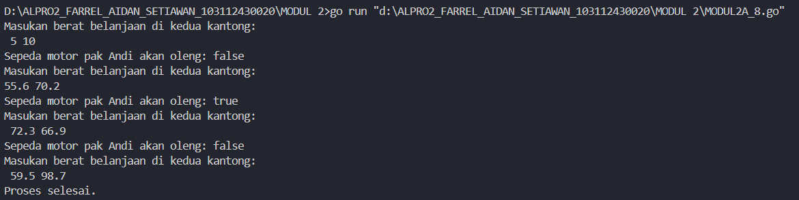


Program ini akan meminta pengguna untuk memasukkan berat belanjaan di dua kantong secara berulang hingga memenuhi kondisi tertentu, lalu menentukan apakah sepeda motor Pak Andi akan oleng atau tidak berdasarkan selisih berat kedua kantong.

Program pertama tama mendeklarasikan dua variabel "berat1" dan "berat2" dengan tipe data float64 untuk menyimpan berat belanjaan di masing masing kantong. Kemudian, program menjalankan perulangan tak terbatas yang akan meminta pengguna memasukkan berat belanjaan setiap iterasi.
Jika pengguna memasukkan berat negatif atau total berat kedua kantong melebihi 150 kg, program akan mencetak "Proses selesai." dan perulangan berhenti. Jika tidak, program menghitung selisih antara berat1 dan berat2. Jika hasilnya negatif, nilai tersebut diubah menjadi positif agar selisih selalu bernilai absolut.

Program kemudian akan mengecek apakah selisih berat antara kedua kantong lebih dari atau sama dengan 9 kg. Jika ya, program mencetak "Sepeda motor pak Andi akan oleng: true", yang berarti sepeda motor akan kehilangan keseimbangan. Jika tidak, program mencetak "Sepeda motor pak Andi akan oleng: false", yang berarti sepeda motor tetap stabil. Program akan terus berjalan sampai kondisi terpenuhi.

<h4>Soal 9</h4>

Diberikan sebuah persamaan sebagai berikut ini. $𝑓(𝑘) = (4𝑘 + 2)^2 /(4𝑘 + 1)(4𝑘 + 3)$ Buatlah sebuah program yang menerima input sebuah bilangan sebagai K, kemudian menghitung dan menampilkan nilai f(K) sesuai persamaan di atas.

```go
package main
import (
    "fmt"
    "math"
)

func main() {
    var k int
    fmt.Scan(&k)
    result := 1.0
    for i := 0; i <= k; i++ {
        numerator := math.Pow(float64(4*k+2), 2)
        denumerator := float64((4 * k) * (4*k + 3))
        result *= numerator / denumerator
    }
    fmt.Printf("Hasil: %.10f\n", result)
}
```

>**Output**
>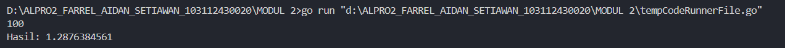


Program ini akan menghitung hasil perkalian dari suatu deret berdasarkan nilai kkk yang dimasukkan oleh pengguna.

Program pertama tama mendeklarasikan variabel `k` sebagai bilangan bulat dan membaca nilainya dari input pengguna. Variabel result ditetapkan dengan nilai 1.0 untuk menyimpan hasil perkalian. Program kemudian menjalankan perulangan, di mana setiap iterasi akan menghitung pecahan dengan numerator = (4k+2)^2 dan denumerator = (4k) * (4k+3), lalu mengalikannya dengan result.

Setelah perulangan selesai, program mencetak hasil perhitungan dengan 10 angka di belakang desimal.

<h4>Soal 10</h4>

PT POS membutuhkan aplikasi perhitungan biaya kirim berdasarkan berat parsel. Maka, buatlah program BiayaPos untuk menghitung biaya pengiriman tersebut dengan ketentuan sebagai berikut! Dari berat parsel (dalam gram), harus dihitung total berat dalam kg dan sisanya (dalam gram). Biaya jasa pengiriman adalah Rp. 10.000,- per kg. Jika sisa berat tidak kurang dari 500 gram, maka tambahan biaya kirim hanya Rp. 5,- per gram saja. Tetapi jika kurang dari 500 gram, maka tambahan biaya akan dibebankan sebesar Rp. 15,- per gram. Sisa berat (yang kurang dari 1kg) digratiskan biayanya apabila total berat ternyata lebih dari 10kg.

```go
package main
import "fmt"

func main() {
    var berat int
    var biaya int

    fmt.Print("masukkan berat (kg): ")
    fmt.Scan(&berat)
    beratkg := berat / 1000
    sisagram := berat % 1000
    biayakg := beratkg * 10000

    if beratkg > 10 {
        biaya = 0
    } else if sisagram >= 500 {
        biaya = sisagram * 5
    } else {
        biaya = sisagram * 15
    }
    totalBiaya := biayakg + biaya
    
    fmt.Printf("Detail berat: %d kg + %d gr\n", beratkg, sisagram)
    fmt.Printf("Detail biaya: Rp. %d + Rp. %d\n", biayakg, biaya)
    fmt.Printf("Total biaya: Rp. %d\n", totalBiaya)
}
```

>**Output**
>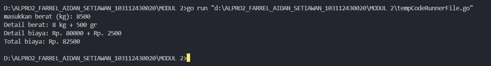

Program ini akan menghitung biaya pengiriman berdasarkan berat barang yang dimasukkan oleh pengguna.

Program pertama tama mendeklarasikan variabel "berat" dengan tipe data integer untuk menyimpan berat dalam gram dan "biaya" dengan tipe data integer untuk menyimpan total biaya pengiriman. Pengguna diminta memasukkan berat barang, yang kemudian diubah menjadi satuan kilogram dan sisa gramnya. Biaya dasar dihitung berdasarkan jumlah kilogram dengan tarif Rp. 10.000 per kg, biayakg = beratkg * 10000.

Jika berat lebih dari 10 kg, "biaya" menjadi nol. Jika sisa gram lebih dari atau sama dengan 500 gr, biayanya dihitung dengan tarif Rp. 5 per gram, sedangkan jika kurang dari 500 gr, biayanya dihitung Rp. 15 per gram. Total biaya dihitung dengan menjumlahkan "biayakg" dan "biaya", lalu ditampilkan dengan format yang menjelaskan detail berat dan biaya.

<h4>Soal 11</h4>

Diberikan sebuah nilai akhir mata kuliah (NAM) [0..100] dan standar penilaian nilai mata kuliah (NMK) sebagai berikut: NAM > 80 (A), 72.5 < NAM ≤ 80 (AB), 65 < NAM ≤ 72.5 (B), 57.5 < NAM ≤ 65 (BC), 50 < NAM ≤ 57.5 (C), 40 < NAM ≤ 50 (D), NAM ≤ 40 (E)

Program berikut menerima input sebuah bilangan riil yang menyatakan NAM. Program menghitung NMK dan menampilkannya.

```go
package main
import “fmt”

func main() {
var nam float64
var nmk string

fmt.Print(“Nilai akhir mata kuliah: “)
fmt.Scanln(&nam)

	if nam > 80 {
		nam = “A”
	}
	if nam > 72.5 {
		nam = “AB”
	}
	if nam > 65 {
		nam = “B”
	}
	if nam > 57.5 {
		nam = “BC”
	}
	if nam > 50 {
		nam = “C”
	}
	if nam > 40 {
		nam = “D”
	} else if nam <= 40 {
		nam = “E”
	}
	fmt.Println(“Nilai mata kuliah: “, nmk)
}
```
Jawablah pertanyaan-pertanyaan berikut: 
a. Jika nam diberikan adalah 80.1, apa keluaran dari program tersebut? Apakah eksekusi program tersebut sesuai spesifikasi soal? 
b. Apa saja kesalahan dari program tersebut? Mengapa demikian? Jelaskan alur program seharusnya! 
c. Perbaiki program tersebut! Ujilah dengan masukan: 93.5; 70.6; dan 49.5. Seharusnya keluaran yang diperoleh adalah ‘A’, ‘B’, dan ‘D’.

```go
package main
import "fmt"

func main() {
    var nam float64
    var nmk string

    fmt.Print("Nilai akhir mata kuliah: ")
    fmt.Scan(&nam)

    if nam > 80 {
        nmk = "A"
    } else if nam > 72.5 {
        nmk = "AB"
    } else if nam > 65 {
        nmk = "B"
    } else if nam > 57.5 {
        nmk = "BC"
    } else if nam > 50 {
        nmk = "C"
    } else if nam > 40 {
        nmk = "D"
    } else {
        nmk = "E"
    }

    fmt.Println("Nilai mata kuliah:", nmk)

}
```

>**Output**
>a. keluaran tidak ada karena variable nam didalam if tidak diubah ke nmk dan karena program memiliki kesalahan penulisan maka menyebabkan eksekusi tidak berjalan dengan benar
>b. 
>kesalahan tipe data: variable nam seharusnya angka namun malah string variable nmk tidak terisi nilai apapun sehingga output tidak ada 
>kesalahan if: beberapa program ifnya terpisah
>alur yang benar: menggunakan if else if dan nam float untuk bilangan/angka dan nmk string untuk huruf
>c.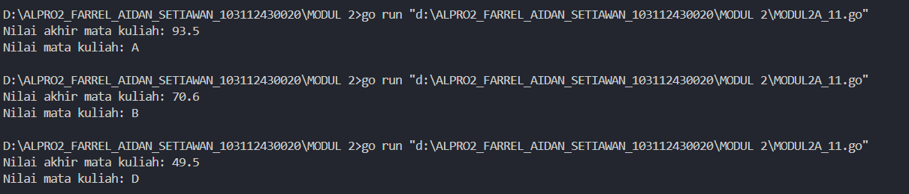


<h4>Soal 12</h4>

Sebuah bilangan bulat b memiliki faktor bilangan f > 0 jika f habis membagi b. Contoh: 2 merupakan faktor dari bilangan 6 karena 6 habis dibagi 2. Buatlah program yang menerima input sebuah bilangan bulat b dan b > 1. Program harus dapat mencari dan menampilkan semua faktor dari bilangan tersebut!
Bilangan bulat b > 0 merupakan bilangan prima p jika dan hanya jika memiliki persis dua faktor bilangan saja, yaitu 1 dan dirinya sendiri. Lanjutkan program sebelumnya. Setelah menerima masukan sebuah bilangan bulat b > 0. Program tersebut mencari dan menampilkan semua faktor bilangan tersebut. Kemudian, program menentukan apakah b merupakan bilangan prima.

```go
package main
import "fmt"

func main() {
    var b int
    var prima bool

    fmt.Print("Bilangan: ")
    fmt.Scan(&b)
    if b <= 1 {
        fmt.Println("Bilangan harus lebih besar dari 1.")
        return
    }

    fmt.Print("Faktor: ")
    for i := 1; i <= b; i++ {
        if b%i == 0 {
            fmt.Print(i, " ")
        }
    }
    
    fmt.Println()

    prima = true
    for i := 2; i < b; i++ {
        if b%i == 0 {
            prima = false
            break
        }
    }
    if b == 1 {
        prima = false
    }
    if prima {
        fmt.Println("Prima: ", true)
    } else {
        fmt.Println("Prima: ", false)
    }
}
```

>**Output**
>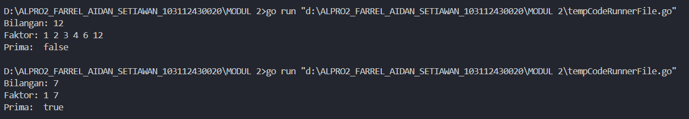
>

Program ini akan menentukan faktor faktor dari sebuah bilangan dan mengecek apakah bilangan tersebut merupakan bilangan prima.

Program pertama tama mendeklarasikan variabel "b" dengan tipe data integer untuk menyimpan bilangan yang dimasukkan pengguna dan variabel "prima" dengan tipe data boolean untuk menyimpan status bilangan prima. Jika "b" kurang dari atau sama dengan 1, program akan mencetak pesan kesalahan dan langsung berhenti. Kemudian, program akan mencetak semua faktor dari "b" dengan melakukan iterasi dari 1 hingga "b" dan mencetak angka yang dapat membagi "b" tanpa sisa.

Setelah itu, program mengecek apakah "b" merupakan bilangan prima dengan menginisialisasi "prima" sebagai true, lalu melakukan iterasi. Jika ditemukan pembagi selain 1 dan "b", maka "prima" diubah menjadi false. Program akhirnya mencetak hasil pengecekan, di mana bilangan prima akan menghasilkan "Prima: true", sedangkan bukan bilangan prima akan menghasilkan "Prima: false".


